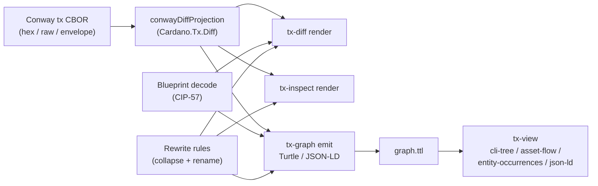

# Architecture

`cardano-tx-tools` is one Haskell package that exposes a layered set of
libraries and eight thin command-line wrappers over them. This page describes
how the components depend on each other and how a Conway transaction flows
through them.

## Components and dependencies

```mermaid
flowchart TD
    subgraph clis["Command-line tools"]
        diff["tx-diff"]
        inspect["tx-inspect"]
        graph["tx-graph"]
        view["tx-view"]
        fetch["tx-fetch"]
        validate["tx-validate"]
        sign["tx-sign"]
        gen["cardano-tx-generator"]
    end

    subgraph libs["Haskell libraries (Cardano.Tx.*)"]
        core["cardano-tx-tools (main lib)<br/>Diff · Blueprint · Rewrite<br/>Graph.Emit · Graph.Rules · View<br/>Sign · Validate · Web2 resolver"]
        txbuild["tx-build<br/>Build · Balance · Evaluate"]
        n2c["n2c-resolver<br/>opt-in N2C resolver"]
        genlib["tx-generator-lib<br/>Generator.*"]
    end

    subgraph ext["External systems"]
        node["local cardano-node<br/>(Node-to-Client)"]
        bf["Blockfrost HTTP"]
        ccli["cardano-cli<br/>(assemble / submit)"]
    end

    diff --> core
    inspect --> core
    graph --> core
    view --> core
    fetch --> core
    validate --> core
    sign --> core
    gen --> genlib

    core --> txbuild
    genlib --> core

    diff --> n2c
    inspect --> n2c
    validate --> n2c
    n2c --> node
    genlib --> node

    fetch --> bf
    core --> bf

    sign -.witness.-> ccli
    diff -.unsigned tx.-> ccli
```

Dependency facts, verified against `cardano-tx-tools.cabal`:

- The **main library** (`cardano-tx-tools`) depends only on the `tx-build`
  sub-library and re-exports its `Build` / `Balance` / `Ledger` modules. It has
  **no** `cardano-node-clients` dependency.
- **`n2c-resolver`** is the only library that links `cardano-node-clients` for
  read access; it is an opt-in sub-library depended on by `tx-diff`,
  `tx-inspect`, and `tx-validate`.
- **`tx-generator-lib`** is the daemon engine behind `cardano-tx-generator`; it
  depends on the main library and on `cardano-node-clients` for submission and
  chain-follower queries.
- The Blockfrost (`Web2`) resolver lives inside the **main library**
  (`Cardano.Tx.Diff.Resolver.Web2`) — it is plain HTTP, not a node client —
  and backs both `tx-fetch` and the optional `--web2-url` resolver on
  `tx-diff` / `tx-inspect`.

## Transaction data flow

All reading tools decode the Conway transaction body (CBOR hex, raw CBOR, or a
`cardano-cli` JSON text envelope) into the same structural projection,
`Cardano.Tx.Diff.conwayDiffProjection`. The diff renderer, the inspect
renderer, and the RDF emitter all walk that one projection.



- **Blueprint decoding** (CIP-57) is shared by `tx-diff` and `tx-graph`: a
  registered blueprint turns Plutus datum and redeemer fields into typed
  values. In `tx-graph` output, decode failures stay non-fatal and surface as
  `cardano:decodeError` triples.
- **Rewriting rules** (the [rewriting-rules grammar](rewriting-rules.md)) are
  shared by `tx-inspect --rules` and `tx-diff --collapse-rules` through one
  loader, and the same file format drives `tx-graph --rules` for its
  operator-entity overlay. The engine always applies `collapse` first, then
  `rename`, regardless of key order in the file.
- **`tx-fetch`** sits upstream of `tx-graph`: it walks a transaction closure
  over Blockfrost and writes one `<txid>.cbor` per transaction into
  `<out-dir>/cbor/`, which `tx-graph --in-dir` then resolves in-memory into a
  Turtle lattice.
- **`tx-view`** sits downstream of `tx-graph`: it projects an emitted canonical
  graph through one of four packaged views, each shipped as both a
  vendor-neutral SPARQL `.rq` contract (under `views/`) and an in-process
  Haskell projection that produces the same byte stream without a SPARQL engine.

## Signing and validation boundaries

`tx-sign` and `tx-validate` sit at the edges of the pipeline:

- **`tx-validate`** opens a Node-to-Client session against a local
  `cardano-node`, resolves the transaction's UTxO, queries protocol parameters
  and the tip slot, and runs the ledger's `Mempool.applyTx` rule. Its exit code
  is the contract pipelines act on (`0` clean, `1` structural failure, `≥2`
  configuration / resolver error).
- **`tx-sign`** unlocks an age-encrypted vault in memory and emits one detached
  vkey witness; the cleartext key never touches disk and the passphrase is
  never read from `argv`. The witness is then attached with `cardano-cli`
  (out of scope for this suite).
