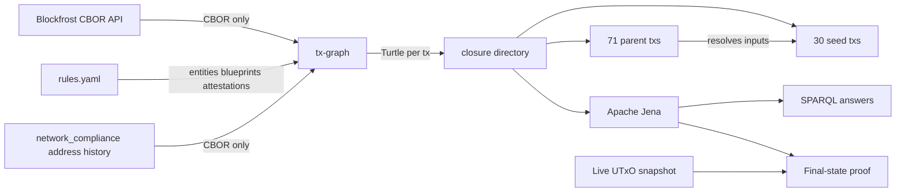

# Amaru Treasury — May 2026 SPARQL Presentation

Twenty-two real SPARQL queries running over a real on-chain lattice built
end-to-end from `tx-graph` + `tx-lattice` + Apache Jena.

- Seed batch — the 30 user-named txs of May 2026 (3 disbursements + 5
  reorganize + 20 swap orders + 1 swap-cancel + 1 scoop dive).
- Closure — fetched from Blockfrost via `/txs/<hash>/cbor` *only*
  (no `/utxos`, no `/inputs`, no `/outputs`). Every input in a seed
  tx points at a parent UTxO; the parent's CBOR is fetched too so
  the JOIN target lives in the same graph. Depth = 1 → 71 parents.
- Emission — latest `tx-lattice` performs the closure walk in two
  passes and emits seed transactions with `tx-graph --closure-dir`, so
  spending redeemers can be decoded using the parent outputs already in
  the closure.
- Total lattice size = **30 seeds + 71 parents = 101 txs**, each in
  its own canonical Turtle file under `closure/<txid>.ttl`.
- State-audit boundary — Queries 14-16 extend the loaded graph with the
  network_compliance address history through the live snapshot boundary
  (block 13,467,438; slot 188,217,701). The 101-tx seed closure is enough
  for seed-flow questions; the final UTxO proof needs every transaction
  that can produce or spend a network_compliance output before that
  boundary.
- USDM accounting boundary — Queries 17-21 turn that complete
  network_compliance graph into a user-facing proof: the treasury starts
  with 0 USDM, receives 425,131.618692 USDM from swaps, pays 418,750 USDM
  to the CAG payee bridge, and retains 6,381.618692 USDM with zero
  accounting gap.
- Operator rules — `rules.yaml` carries on-chain entities, off-chain
  vendors, IPFS-anchored attestations, and CIP-57 blueprints.
- Engine — Apache Jena 5.6.0 `sparql` CLI.

## Query Tree

The demo rule source and query sources are standalone files. These
links are the single-file query demos used by the rendered page. The
tree is grouped by the question a reader is trying to answer first,
while preserving the original query numbers as stable identifiers.

Rules source: [`rules.yaml`](may-2026-amaru-lattice/rules.yaml)

-   **Final network-compliance state**

    ---

    **Recompute terminal state**

    - [Query 14 — Network compliance terminal state](may-2026-amaru-lattice/queries/14-network-compliance-terminal-state.md) [.rq](may-2026-amaru-lattice/queries/14-network-compliance-terminal-state.rq)
    - [Query 15 — Network compliance live diff](may-2026-amaru-lattice/queries/15-network-compliance-live-diff.md) [.rq](may-2026-amaru-lattice/queries/15-network-compliance-live-diff.rq)
    - [Query 16 — Network compliance live summary](may-2026-amaru-lattice/queries/16-network-compliance-live-summary.md) [.rq](may-2026-amaru-lattice/queries/16-network-compliance-live-summary.rq)

    **Explain terminal balances**

    - [Query 20 — Terminal USDM provenance](may-2026-amaru-lattice/queries/20-terminal-usdm-provenance.md) [.rq](may-2026-amaru-lattice/queries/20-terminal-usdm-provenance.rq)

-   **Treasury USDM movement**

    ---

    **Whole-account proof**

    - [Query 17 — Network compliance USDM accounting](may-2026-amaru-lattice/queries/17-network-compliance-usdm-accounting.md) [.rq](may-2026-amaru-lattice/queries/17-network-compliance-usdm-accounting.rq)
    - [Query 11 — Network compliance USDM residual](may-2026-amaru-lattice/queries/11-network-compliance-usdm-residual.md) [.rq](may-2026-amaru-lattice/queries/11-network-compliance-usdm-residual.rq)

    **Incoming USDM**

    - [Query 21 — Treasury USDM payers](may-2026-amaru-lattice/queries/21-treasury-usdm-payers.md) [.rq](may-2026-amaru-lattice/queries/21-treasury-usdm-payers.rq)

    **Outgoing USDM**

    - [Query 02 — Treasury USDM payees](may-2026-amaru-lattice/queries/02-usdm-output-addresses.md) [.rq](may-2026-amaru-lattice/queries/02-usdm-output-addresses.rq)
    - [Query 18 — Beneficiary USDM payments](may-2026-amaru-lattice/queries/18-beneficiary-usdm-payments.md) [.rq](may-2026-amaru-lattice/queries/18-beneficiary-usdm-payments.rq)

-   **Swaps and exchange rates**

    ---

    **Order and scoop evidence**

    - [Query 08 — Sundae V3 order consumers](may-2026-amaru-lattice/queries/08-sundae-v3-order-consumers.md) [.rq](may-2026-amaru-lattice/queries/08-sundae-v3-order-consumers.rq)
    - [Query 10 — Sundae V3 scoop output candidates](may-2026-amaru-lattice/queries/10-sundae-v3-scoop-output-candidates.md) [.rq](may-2026-amaru-lattice/queries/10-sundae-v3-scoop-output-candidates.rq)

    **Rate computation**

    - [Query 19 — Swap receipts and rates](may-2026-amaru-lattice/queries/19-swap-receipts-and-rates.md) [.rq](may-2026-amaru-lattice/queries/19-swap-receipts-and-rates.rq)

-   **Seed-batch conservation and totals**

    ---

    **Batch totals**

    - [Query 00 — ADA conservation](may-2026-amaru-lattice/queries/00-ada-conservation.md) [.rq](may-2026-amaru-lattice/queries/00-ada-conservation.rq)
    - [Query 01 — Monthly totals](may-2026-amaru-lattice/queries/01-monthly-totals.md) [.rq](may-2026-amaru-lattice/queries/01-monthly-totals.rq)
    - [Query 13 — Seed value conservation by asset](may-2026-amaru-lattice/queries/13-seed-value-conservation-by-asset.md) [.rq](may-2026-amaru-lattice/queries/13-seed-value-conservation-by-asset.rq)

    **Role flows**

    - [Query 03 — ADA role flow](may-2026-amaru-lattice/queries/03-ada-role-flow.md) [.rq](may-2026-amaru-lattice/queries/03-ada-role-flow.rq)
    - [Query 07 — USDM role flow](may-2026-amaru-lattice/queries/07-usdm-role-flow.md) [.rq](may-2026-amaru-lattice/queries/07-usdm-role-flow.rq)

-   **Graph completeness and resolution**

    ---

    **Resolved inputs**

    - [Query 12 — Seed input resolution cardinality](may-2026-amaru-lattice/queries/12-seed-input-resolution-cardinality.md) [.rq](may-2026-amaru-lattice/queries/12-seed-input-resolution-cardinality.rq)

    **Reference inputs**

    - [Query 09 — Reference-input reuse](may-2026-amaru-lattice/queries/09-reference-input-reuse.md) [.rq](may-2026-amaru-lattice/queries/09-reference-input-reuse.rq)

-   **Governance, signers, and payment intent**

    ---

    **Authorization**

    - [Query 04 — Required signer distribution](may-2026-amaru-lattice/queries/04-required-signer-distribution.md) [.rq](may-2026-amaru-lattice/queries/04-required-signer-distribution.rq)

    **Payment intent**

    - [Query 05 — Vendor-payment overlay](may-2026-amaru-lattice/queries/05-vendor-payment-overlay.md) [.rq](may-2026-amaru-lattice/queries/05-vendor-payment-overlay.rq)
    - [Query 06 — Disbursement candidates](may-2026-amaru-lattice/queries/06-disbursement-candidates.md) [.rq](may-2026-amaru-lattice/queries/06-disbursement-candidates.rq)

