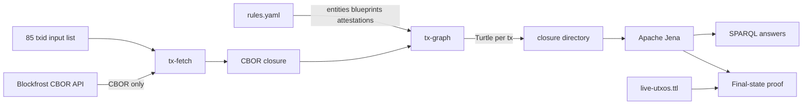

# Amaru Treasury - May 2026 SPARQL Presentation

Direct network-state SPARQL queries running over a real on-chain graph
built end-to-end from `tx-fetch` + `tx-graph` + Apache Jena.

- Network-scope transaction set — the 85 txids that touch the
  `amaru-treasury.network_compliance` address during the report window.
  The report treats this list as an input boundary; how the list was
  assembled is outside the graph proof.
- Closure — fetched by `tx-fetch` from Blockfrost via
  `/txs/<hash>/cbor` *only*
  (no `/utxos`, no `/inputs`, no `/outputs`). Fetch depth is `0`: no
  generic parent walk is needed for the network treasury final-state
  proof because every in-scope producer/spender transaction is already
  in the 85-tx list.
- Emission — `tx-graph --rules rules.yaml --in-dir closure/cbor
  --out-dir closure` indexes every fetched CBOR by computed transaction
  id and emits one canonical Turtle file per transaction.
- State boundary — the final UTxO state is recomputed from graph topology:
  outputs to the network treasury minus outputs whose `(txid, index)` is
  consumed by another transaction in the same 85-tx graph.
- Total graph size = **85 network-scope txs**, each in
  its own canonical Turtle file under `closure/<txid>.ttl`.
- State-audit boundary — Queries 14-16 use the 85-tx
  network_compliance address history through the live snapshot boundary
  (block 13,467,438; slot 188,217,701). Query 14 is graph-only. Queries
  15-16 compare that graph-derived state with the separate live snapshot
  in `live-utxos.ttl`.
- USDM accounting boundary — Queries 17-21 turn that complete
  network_compliance graph into a user-facing proof: the treasury starts
  with 0 USDM, receives 425,131.618692 USDM from swaps, pays 418,750 USDM
  to the CAG payee bridge, and retains 6,381.618692 USDM with zero
  accounting gap.
- Operator rules — `rules.yaml` carries on-chain entities, off-chain
  vendors, IPFS-anchored attestations, and CIP-57 blueprints.
- Engine — Apache Jena 5.6.0 `sparql` CLI.

## Query Tree

The proof inputs and query sources are standalone files. These links are
the single-file query demos used by the rendered page. The tree is
grouped by the question a reader is trying to answer first, while
preserving the original query numbers as stable identifiers.

Rules source: [`rules.yaml`](may-2026-amaru-lattice/rules.yaml)

Network-scope txids: [`network-txs.txt`](may-2026-amaru-lattice/network-txs.txt)

Live UTxO snapshot for Queries 15-16:
[`live-utxos.ttl`](may-2026-amaru-lattice/live-utxos.ttl)

-   **Final network-compliance state**

    ---

    **Recompute terminal state**

    - [Query 14 — Network compliance terminal state](may-2026-amaru-lattice/queries/14-network-compliance-terminal-state.md)
    - [Query 15 — Network compliance live diff](may-2026-amaru-lattice/queries/15-network-compliance-live-diff.md)
    - [Query 16 — Network compliance live summary](may-2026-amaru-lattice/queries/16-network-compliance-live-summary.md)

    **Explain terminal balances**

    - [Query 20 — Terminal USDM provenance](may-2026-amaru-lattice/queries/20-terminal-usdm-provenance.md)

-   **Treasury USDM movement**

    ---

    **Whole-account proof**

    - [Query 17 — Network compliance USDM accounting](may-2026-amaru-lattice/queries/17-network-compliance-usdm-accounting.md)
    - [Query 11 — Network compliance USDM residual](may-2026-amaru-lattice/queries/11-network-compliance-usdm-residual.md)

    **Incoming USDM**

    - [Query 21 — Treasury USDM payers](may-2026-amaru-lattice/queries/21-treasury-usdm-payers.md)

    **Outgoing USDM**

    - [Query 02 — Treasury USDM payees](may-2026-amaru-lattice/queries/02-usdm-output-addresses.md)
    - [Query 18 — Beneficiary USDM payments](may-2026-amaru-lattice/queries/18-beneficiary-usdm-payments.md)

-   **Swaps and exchange rates**

    ---

    **Rate computation and receipts**

    - [Query 19 — Swap receipts and rates](may-2026-amaru-lattice/queries/19-swap-receipts-and-rates.md)

The earlier seed-batch diagnostic pages are intentionally not linked from
this proof index. They depended on `cardano:hasLatticeRole` markers and
parent-closure resolution from the old `tx-lattice` path. The PR117
proof path is the direct `tx-fetch --depth 0` plus `tx-graph` graph over
the 85 network-scope transactions above.
