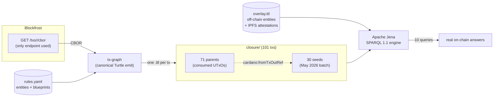
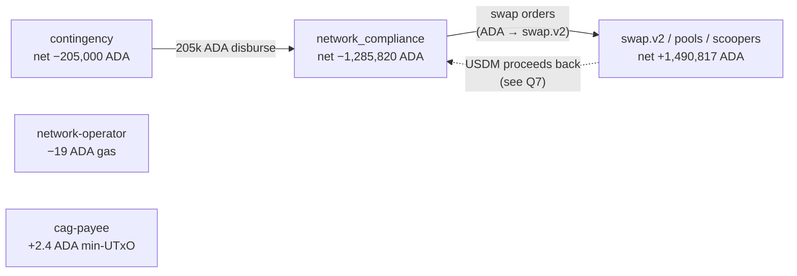
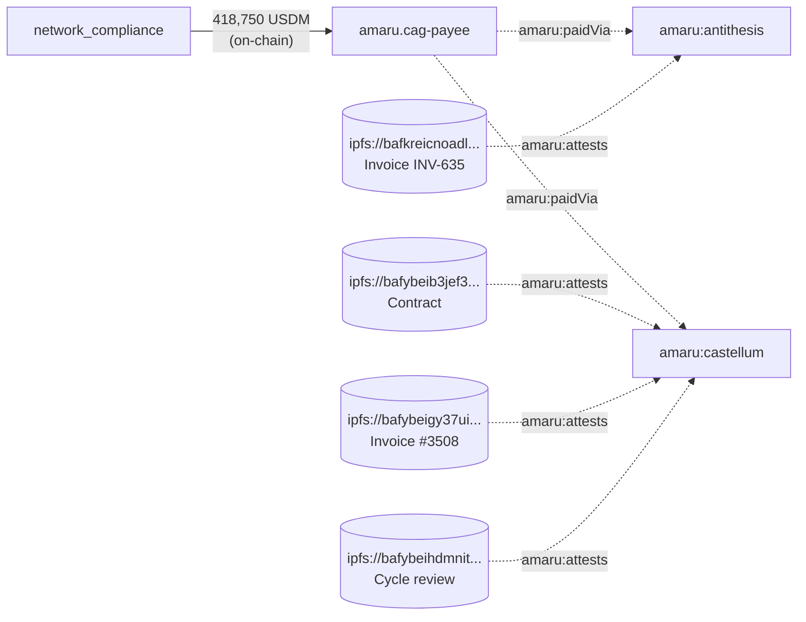
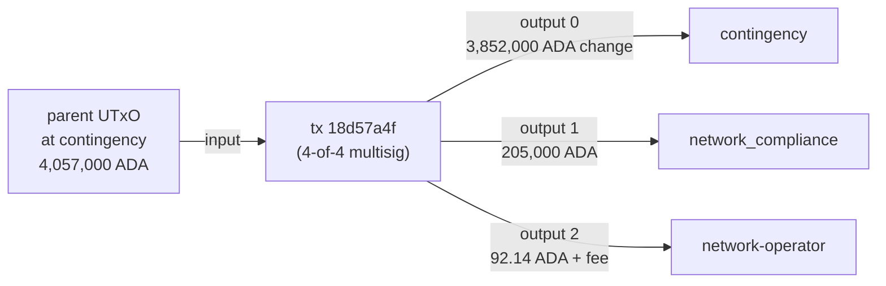
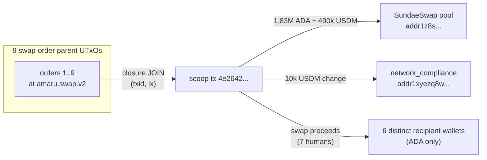

# Amaru Treasury — May 2026 SPARQL Presentation

Ten real SPARQL queries running over a real on-chain lattice built
end-to-end from `tx-graph` + `tx-lattice` + Apache Jena.

- Seed batch — the 30 user-named txs of May 2026 (3 disbursements + 5
  reorganize + 20 swap orders + 1 swap-cancel + 1 scoop dive).
- Closure — fetched from Blockfrost via `/txs/<hash>/cbor` *only*
  (no `/utxos`, no `/inputs`, no `/outputs`). Every input in a seed
  tx points at a parent UTxO; the parent's CBOR is fetched too so
  the JOIN target lives in the same graph. Depth = 1 → 71 parents.
- Total lattice size = **30 seeds + 71 parents = 101 txs**, each in
  its own canonical Turtle file under `closure/<txid>.ttl`.
- Operator overlay — `rules.yaml` (entities + CIP-57 blueprints) plus
  `overlay.ttl` (off-chain vendors + IPFS-anchored attestations).
- Engine — Apache Jena 5.6.0 `sparql` CLI.



---

## Query 0 — Conservation check

Sanity gate: total ADA consumed by seed inputs must equal total ADA
emitted in seed outputs + total fees. Any non-zero gap is a
bug in the lattice (missing closure, predicate mismatch, …).

```sparql
PREFIX cardano: <https://lambdasistemi.github.io/cardano-knowledge-maps/vocab/cardano#>

SELECT ?totalSeedInputLovelace ?totalSeedOutputLovelace ?totalSeedFee
       ((?totalSeedInputLovelace - ?totalSeedOutputLovelace - ?totalSeedFee) AS ?gap)
WHERE {
  { SELECT (SUM(?l) AS ?totalSeedInputLovelace) WHERE {
      ?seed cardano:hasLatticeRole "seed" ; cardano:hasInput ?in .
      ?in cardano:fromTxOutRef ?ref .
      ?ref cardano:hasTxId ?h ; cardano:hasIndex ?ix .
      ?h cardano:bytesHex ?parentHex .
      ?parent cardano:hasTxId/cardano:bytesHex ?parentHex ; cardano:hasOutput ?parentOut .
      ?parentOut cardano:hasIndex ?ix ; cardano:lovelace ?l .
  } }
  { SELECT (SUM(?l) AS ?totalSeedOutputLovelace) WHERE {
      ?seed cardano:hasLatticeRole "seed" ; cardano:hasOutput ?out .
      ?out cardano:lovelace ?l .
  } }
  { SELECT (SUM(?f) AS ?totalSeedFee) WHERE {
      ?seed cardano:hasLatticeRole "seed" ; cardano:hasFee ?f .
  } }
}
```

| input ADA      | output ADA     | fee ADA  | gap ADA |
|----------------|----------------|----------|---------|
| 22,186,097.902 | 22,186,077.971 | 19.931   | **0.000** |

**Books balance exactly. The lattice is conservation-complete.**

---

## Query 1 — Monthly totals

```sparql
PREFIX cardano: <https://lambdasistemi.github.io/cardano-knowledge-maps/vocab/cardano#>
SELECT (COUNT(?tx) AS ?seedTxCount)
       (SUM(?fee) AS ?totalFeeLovelace)
       (MIN(?fee) AS ?minFee)
       (MAX(?fee) AS ?maxFee)
WHERE { ?tx cardano:hasLatticeRole "seed" ; cardano:hasFee ?fee . }
```

| seed tx count | total fee  | min fee     | max fee     |
|---------------|-----------:|------------:|------------:|
| 30            | 19.93 ADA  | 0.244 ADA   | 1.572 ADA   |

The contingency disburse is the most expensive single tx (4-of-4
multisig + 4 reference inputs + 1 withdrawal); the cheapest are the
single-author swap-order opens.

---

## Query 2 — Where did USDM land?

```sparql
PREFIX cardano: <https://lambdasistemi.github.io/cardano-knowledge-maps/vocab/cardano#>
PREFIX rdf: <http://www.w3.org/1999/02/22-rdf-syntax-ns#>
SELECT ?destBech32 (SUM(?qty) AS ?usdmReceived)
WHERE {
  ?seed cardano:hasLatticeRole "seed" ; cardano:hasOutput ?out .
  ?out cardano:atAddress/cardano:bech32 ?destBech32 ;
       cardano:hasAssetValue/rdf:rest*/rdf:first ?asset .
  ?asset cardano:hasIdentifier ?id ; cardano:quantity ?qty .
  ?id cardano:bytesHex
        "c48cbb3d5e57ed56e276bc45f99ab39abe94e6cd7ac39fb402da47ad0014df105553444d" .
}
GROUP BY ?destBech32
ORDER BY DESC(?usdmReceived)
```

| destination (truncated)        | USDM         |
|--------------------------------|-------------:|
| `addr1xyezq8w...` (network_compliance) | 1,146,156.66 |
| `addr1z8srqftq...` (SundaeSwap pool)   |   490,819.15 |
| `addr1q8qrds2n...` (cag-payee)         |   418,750.00 |

The biggest USDM bucket lands back on network_compliance — those
are change outputs from swap orders that completed. The
418,750 USDM at cag-payee is the bridge-out for May's vendor
invoices.

---

## Query 3 — Per-scope ADA flow

```sparql
# Body of the query — full version uses VALUES + IF mapping; see
# queries/03-scope-flow.rq. The "other" bucket holds every bech32
# NOT in the four named scopes so conservation holds across the
# whole table.
SELECT ?scope (SUM(?lovIn) AS ?ada_in) (SUM(?lovOut) AS ?ada_out)
       ((SUM(?lovIn) - SUM(?lovOut)) AS ?net)
WHERE {
  { ?seed cardano:hasLatticeRole "seed" ; cardano:hasOutput ?out .
    ?out cardano:atAddress/cardano:bech32 ?bech ; cardano:lovelace ?lovIn .
    BIND (0 AS ?lovOut) }
  UNION
  { ?seed cardano:hasLatticeRole "seed" ; cardano:hasInput ?in .
    ?in cardano:fromTxOutRef ?ref .
    ?ref cardano:hasTxId ?h ; cardano:hasIndex ?ix .
    ?h cardano:bytesHex ?parentHex .
    ?parent cardano:hasTxId/cardano:bytesHex ?parentHex ; cardano:hasOutput ?parentOut .
    ?parentOut cardano:hasIndex ?ix ;
               cardano:atAddress/cardano:bech32 ?bech ;
               cardano:lovelace ?lovOut .
    BIND (0 AS ?lovIn) }
  BIND ( IF(?bech = "...", "amaru-treasury.contingency", ... "other") AS ?scope )
}
GROUP BY ?scope
```

| scope                                     | ADA in        | ADA out       | net           |
|-------------------------------------------|--------------:|--------------:|--------------:|
| amaru-treasury.network_compliance         | 14,923,951.46 | 16,209,772.18 | **−1,285,820.72** |
| amaru-treasury.contingency                |  3,852,000.00 |  4,057,000.00 |    **−205,000.00** |
| other (swap.v2 + pools + scoopers + …)    |  3,407,732.62 |  1,916,915.17 |    **+1,490,817.45** |
| amaru.network-operator                    |      2,391.52 |      2,410.55 |          −19.03 |
| amaru.cag-payee                           |          2.38 |          0.00 |          +2.38 |

Sum of `net` = −19.93 ADA = the total of Q1 fees (perfect conservation).
The 205k ADA disburse left contingency and landed at
network_compliance; another 1.29M ADA left network_compliance into
swap.v2 orders (recovered as USDM on the scoop side).



---

## Query 4 — Multisig shape distribution

```sparql
PREFIX cardano: <https://lambdasistemi.github.io/cardano-knowledge-maps/vocab/cardano#>
SELECT ?requiredSigners (COUNT(?seed) AS ?txCount)
WHERE {
  { SELECT ?seed (COUNT(DISTINCT ?sig) AS ?requiredSigners) WHERE {
      ?seed cardano:hasLatticeRole "seed" ; cardano:hasRequiredSigner ?sig .
  } GROUP BY ?seed }
  UNION
  { ?seed cardano:hasLatticeRole "seed" .
    FILTER NOT EXISTS { ?seed cardano:hasRequiredSigner ?_ }
    BIND (0 AS ?requiredSigners) }
}
GROUP BY ?requiredSigners
ORDER BY DESC(?requiredSigners)
```

| required signers | tx count |
|-----------------:|---------:|
| 4                | 1        |
| 2                | 23       |
| 1                | 6        |

The single 4-of-4 tx is the contingency disburse (highest authority).
The 2-of-N shape covers vendor-payment + reorganize. The 1-signer
shape covers swap-order opens, swap-cancel, and scoop participation.

---

## Query 5 — Vendor-payment chain (lattice × overlay)

```sparql
PREFIX cardano: <https://lambdasistemi.github.io/cardano-knowledge-maps/vocab/cardano#>
PREFIX amaru:   <https://amaru.tech/rdf/>
PREFIX rdfs:    <http://www.w3.org/2000/01/rdf-schema#>
PREFIX rdf:     <http://www.w3.org/1999/02/22-rdf-syntax-ns#>

SELECT ?vendor ?attestation ?ipfs ?usdmTotalAtBridge
WHERE {
  { SELECT (SUM(?qty) AS ?usdmTotalAtBridge) WHERE {
      ?seed cardano:hasLatticeRole "seed" ; cardano:hasOutput ?out .
      ?out cardano:atAddress/cardano:bech32
             "addr1q8qrds2nnx7clx3kcpp2l0eu45twmdcahsfu9m0xcwy59j6xz3vs0hnfaz9nhje8z34kfnds4jyk7hs6dnrag6e2lfgqtyf4rl" ;
           cardano:hasAssetValue/rdf:rest*/rdf:first ?asset .
      ?asset cardano:hasIdentifier ?id ; cardano:quantity ?qty .
      ?id cardano:bytesHex
            "c48cbb3d5e57ed56e276bc45f99ab39abe94e6cd7ac39fb402da47ad0014df105553444d" .
  } }
  ?vendor amaru:paidVia amaru:cag-payee .
  ?attestation amaru:attests ?vendor ; amaru:ipfs ?ipfs .
}
```

| vendor (overlay)          | IPFS attestation                                                                                  |
|---------------------------|---------------------------------------------------------------------------------------------------|
| `amaru:antithesis`        | `ipfs://bafkreicnoadlgnc6cqxggxboho7yt532lkonxcusj3ndsxdnv5szyswyam` — Invoice INV-635           |
| `amaru:castellum`         | `ipfs://bafybeib3jef34ndw6oe24mkmifdvxe5jrv7ulh63rdllovyth27mqfj2da` — Contract                  |
| `amaru:castellum`         | `ipfs://bafybeigy37ui2ikn7bim2vw6cojcbxkcndpjwh7cj5fv3vzs4cszezipxu` — Invoice #3508             |
| `amaru:castellum`         | `ipfs://bafybeihdmnitrbu2oir3r2fefnpqy3bk7zdz42olzmltmxyt5xag4i2t5a` — May2026 cycle review      |

USDM total at the bridge in May = **418,750.00 USDM**. The query joins
on-chain USDM movement (lattice) to off-chain accountability
(overlay) — vendors, contracts, invoices, cycle reviews — by
walking `amaru:paidVia` and `amaru:attests` across two graph
sources in one SPARQL invocation.



---

## Query 6 — Disbursement detection

```sparql
PREFIX cardano: <https://lambdasistemi.github.io/cardano-knowledge-maps/vocab/cardano#>

SELECT ?seedTxId ?lovelaceDisbursed
WHERE {
  ?seed cardano:hasLatticeRole "seed" ;
        cardano:hasTxId/cardano:bytesHex ?seedTxId ;
        cardano:hasInput ?in ;
        cardano:hasOutput ?out .
  ?in cardano:fromTxOutRef ?ref .
  ?ref cardano:hasTxId ?h ; cardano:hasIndex ?ix .
  ?h cardano:bytesHex ?parentHex .
  ?parent cardano:hasTxId/cardano:bytesHex ?parentHex ; cardano:hasOutput ?parentOut .
  ?parentOut cardano:hasIndex ?ix ;
             cardano:atAddress/cardano:bech32 "addr1x8ndhlc...contingency" .
  ?out cardano:atAddress/cardano:bech32 "addr1xyezq8w...network_compliance" ;
       cardano:lovelace ?lovelaceDisbursed .
}
```

| tx hash                                                              | disbursed ADA |
|----------------------------------------------------------------------|--------------:|
| `18d57a4f104df4cc776104ce626958e2110122392e4c4c7671edc8861b48452e`   | 205,000.000   |

One disbursement in May: 205,000 ADA from contingency to
network_compliance. The query never needed a typed-redeemer decode —
it pattern-matches on the closure-resolved input address + the
output address.



---

## Query 7 — Per-scope USDM flow

```sparql
# Same closure JOIN as Q3 but counts USDM instead of lovelace.
# Full query at queries/07-usdm-scope-flow.rq.
SELECT ?scope (SUM(?qIn) AS ?usdm_in) (SUM(?qOut) AS ?usdm_out)
       ((SUM(?qIn) - SUM(?qOut)) AS ?net)
WHERE { /* IN: seed outputs at ?bech with USDM   */
        /* OUT: closure-resolved seed input UTxOs at ?bech with USDM */
        /* BIND ?bech → ?scope (entity slug or "other") */
}
GROUP BY ?scope
```

| scope                                     | USDM in     | USDM out    | net          |
|-------------------------------------------|------------:|------------:|-------------:|
| amaru-treasury.network_compliance         | 1,146,156.66 | 1,554,849.98 | **−408,693.32** |
| other (SundaeSwap pool, batchers)         |   490,819.15 |   500,875.83 |     **−10,056.68** |
| amaru.cag-payee                           |   418,750.00 |         0.00 |    **+418,750.00** |

**TOTAL: 2,055,725.81 in = 2,055,725.81 out, conservation exact.**

network_compliance lost 408,693 USDM net over the month — 418,750
of that went to cag-payee (vendor bridge); the 10,057 USDM
"shortfall" was absorbed by SundaeSwap batcher fees / slippage
(visible directly in the `other` row).

---

## Query 8 — Scoop detection

```sparql
PREFIX cardano: <https://lambdasistemi.github.io/cardano-knowledge-maps/vocab/cardano#>

SELECT ?seedTxId (COUNT(DISTINCT ?parentOut) AS ?swapOrdersConsumed)
WHERE {
  ?seed cardano:hasLatticeRole "seed" ;
        cardano:hasTxId/cardano:bytesHex ?seedTxId ;
        cardano:hasInput ?in .
  ?in cardano:fromTxOutRef ?ref .
  ?ref cardano:hasTxId ?h ; cardano:hasIndex ?ix .
  ?h cardano:bytesHex ?parentHex .
  ?parent cardano:hasTxId/cardano:bytesHex ?parentHex ; cardano:hasOutput ?parentOut .
  ?parentOut cardano:hasIndex ?ix ;
             cardano:atAddress/cardano:hasPaymentCredential/cardano:hasIdentifier ?id .
  ?id cardano:bytesHex
        "fa6a58bbe2d0ff05534431c8e2f0ef2cbdc1602a8456e4b13c8f3077" .
}
GROUP BY ?seedTxId
ORDER BY DESC(?swapOrdersConsumed)
```

| tx hash                                                              | swap orders consumed |
|----------------------------------------------------------------------|----:|
| `4e2642080c8d171aad05baed11b076de498b76acecc1c2412660048fae8aefa3`   | 9   |
| `a8bab7bfe1e2ed9d3a5b40189c8de51c5974a6e05c71fc1000a6abd57500b365`   | 1   |

Two scoops in May. The **9-order scoop dive** is the one the
operator asked to demo — `4e2642...`. The 1-order tx is a single
swap-cancel that pulls one order back out of the pool. The query
doesn't pattern-match on tx shape — it pattern-matches on
*consumption of a swap.v2 UTxO* via the closure JOIN.

---

## Query 9 — Reference-script reuse

```sparql
PREFIX cardano: <https://lambdasistemi.github.io/cardano-knowledge-maps/vocab/cardano#>

SELECT ?parentTxId ?ix (COUNT(DISTINCT ?seed) AS ?usingSeedTxs)
WHERE {
  ?seed cardano:hasLatticeRole "seed" ;
        cardano:hasReferenceInput ?ref .
  ?ref cardano:fromTxOutRef ?refTxOutRef .
  ?refTxOutRef cardano:hasTxId ?h ; cardano:hasIndex ?ix .
  ?h cardano:bytesHex ?parentTxId .
}
GROUP BY ?parentTxId ?ix
ORDER BY DESC(?usingSeedTxs) ?parentTxId
LIMIT 5
```

| parent tx hash (truncated)         | output ix | seed txs reusing it |
|------------------------------------|----------:|--------------------:|
| `11ace24a7b0caad4...`              | 0         | 28                  |
| `25ba96f5deb14bb5...`              | 2         | 27                  |
| `810bfcbde85ae72f...`              | 0         | 27                  |
| `e7b395a93d49a179...`              | 2         | 27                  |

Four hot reference UTxOs carry 95%+ of the month's reference-script
usage — the canonical published treasury, swap.v2, and SundaeSwap
batcher scripts. Cardano CIP-31 reference inputs are working as
intended.

---

## Query 10 — Scoop-recipient resolution (blueprint-free workaround)

This is the demo of the documented [tx-lattice limitation
workaround](tx-lattice.md#known-limitations): follow a swap order
to its scoop to find the human recipient WITHOUT decoding the
swap-order datum.

```sparql
PREFIX cardano: <https://lambdasistemi.github.io/cardano-knowledge-maps/vocab/cardano#>
PREFIX rdf:     <http://www.w3.org/1999/02/22-rdf-syntax-ns#>

SELECT ?scoopTxId ?recipientBech32 ?recipientLovelace ?recipientUsdm
WHERE {
  # 1. Identify scoop seed txs (≥1 swap.v2 utxo consumed via closure)
  { SELECT DISTINCT ?scoopTxId WHERE {
      ?B cardano:hasLatticeRole "seed" ; cardano:hasTxId/cardano:bytesHex ?scoopTxId ;
         cardano:hasInput ?in .
      ?in cardano:fromTxOutRef ?ref .
      ?ref cardano:hasTxId ?h ; cardano:hasIndex ?ix .
      ?h cardano:bytesHex ?parentHex .
      ?A cardano:hasTxId/cardano:bytesHex ?parentHex ; cardano:hasOutput ?orderOut .
      ?orderOut cardano:hasIndex ?ix ;
                cardano:atAddress/cardano:hasPaymentCredential/cardano:hasIdentifier ?id .
      ?id cardano:bytesHex
            "fa6a58bbe2d0ff05534431c8e2f0ef2cbdc1602a8456e4b13c8f3077" .
  } }
  # 2. List the scoop's non-swap-script outputs as recipient candidates
  ?scoop cardano:hasTxId/cardano:bytesHex ?scoopTxId ; cardano:hasOutput ?recipientOut .
  ?recipientOut cardano:atAddress ?recipientAddr ;
                cardano:lovelace ?recipientLovelace .
  ?recipientAddr cardano:bech32 ?recipientBech32 .
  FILTER NOT EXISTS {
    ?recipientAddr cardano:hasPaymentCredential/cardano:hasIdentifier ?rId .
    ?rId cardano:bytesHex
           "fa6a58bbe2d0ff05534431c8e2f0ef2cbdc1602a8456e4b13c8f3077" .
  }
  OPTIONAL {
    ?recipientOut cardano:hasAssetValue/rdf:rest*/rdf:first ?asset .
    ?asset cardano:hasIdentifier ?usdmId ; cardano:quantity ?recipientUsdm .
    ?usdmId cardano:bytesHex
              "c48cbb3d5e57ed56e276bc45f99ab39abe94e6cd7ac39fb402da47ad0014df105553444d" .
  }
}
```

For the 9-order scoop dive `4e2642...`:

| recipient (truncated)                            | ADA            | USDM        |
|--------------------------------------------------|---------------:|------------:|
| `addr1z8srqftq...` (SundaeSwap pool / settlement) | 1,833,033.39   | 490,819.15  |
| `addr1xyezq8w...` (network_compliance change)     |         2.54   |  10,056.68  |
| `addr1q93k6rg...` (human user 1)                 |     5,374.67   |       0.00  |
| `addr1qyh6anc...` (human user 2)                 |     5,054.62   |       0.00  |
| `addr1q97zqkf...` (human user 3)                 |     4,081.06   |       0.00  |
| `addr1q9v792a...` (human user 4, 3 UTxOs)        |    11,357.0    |       0.00  |
| `addr1v998zy8...` (human user 5)                 |     3,150.98   |       0.00  |
| `addr1qy4xf86...` (human user 6, 2 UTxOs)        |     2,040.17   |       0.00  |



The cross-tx JOIN answers *"where did the value go after the
scoop?"* directly from the closure — no datum decode required.
The 6 distinct human recipients are visible from address triples
alone.

---

# Limitations to be solved on our side

Each of these is a real gap in the present-day pipeline that
limits SPARQL expressiveness; each has a known fix path.

## 1. `tx-graph` does not emit `cardano:hasIndex` on outputs

**Impact**: a tx output's index in its parent tx is needed for
the closure JOIN (`?orderOut cardano:hasIndex ?ix`) but tx-graph
encodes the index only in the bnode label (`_:output1`,
`_:output2`, …). Blank-node labels are not semantic in RDF.

**Resolved** (#100, in `Cardano.Tx.Graph.Emit.Project.emitOutput`):
the body emitter now emits `cardano:hasIndex` (zero-based) on every
output as part of the canonical Turtle. The `scripts/tx-lattice`
post-processing block has been removed.

## 2. `tx-graph` does not emit the tx's own hash

**Resolved** (#100, in `Cardano.Tx.Graph.Emit.Project.emitTxBlock`):
the body emitter now hashes the Conway tx body via
`Cardano.Ledger.Hashes.hashAnnotated` and pins it as
`_:tx cardano:hasTxId _:hash_txid_<HEX>` — using the same
`Identifier`-typed bnode pattern as inputs' parent-txid references,
so SPARQL JOINs across the closure use
`cardano:hasTxId/cardano:bytesHex` uniformly.

## 3. CIP-57 blueprint binding rejects two scripts sharing a blueprint

**Resolved** (#101, in `Cardano.Tx.Graph.Rules.Load.Resolve.Imports.dedupBlueprints`):
the loader now distinguishes two cases when a predicate URI is
declared twice. If both registrations point at the same parsed
`Blueprint` value, both script-hash bindings are accepted — this
is the operator-intended "shared parameterised contract" pattern
(Amaru contingency vs network_compliance both spending the
`treasury.treasury.spend` contract). A true cross-blueprint
predicate-URI collision still fails fast with
`DuplicateBlueprintPredicate`. The presentation's `rules.yaml`
can now register `amaru-treasury.cip57.json` against both
treasury scopes and surface the typed redeemer decode on either
side once gap #4 lands.

## 4. Typed redeemer decode not firing on live mainnet

**Resolved** (#112 — landed in the same PR as #103). The root
cause was that
`Cardano.Tx.Graph.Emit.Witness.resolveRedeemerPurposeHash` for
`ConwaySpending` derives the spending script hash by reading the
consumed input's `TxOut` from a `ResolvedUTxO` map; the lattice
ran `tx-graph` without `--utxo` (the JSON decoder was a
syntax-only stub) and without `--n2c-socket-path` (no live
node), so the map was empty and dispatch silently fell back to
`NoBlueprintRegistered`.

The fix introduces **a lattice-aware in-memory resolver**:

* `tx-graph --in-dir DIR` indexes every CBOR in DIR by its
  computed `TxId` (`hashAnnotated . bodyTxL`) and resolves each
  emitted tx's spending / reference / collateral inputs against
  the in-memory map — pulling the parent body's output at the
  consumed `TxIx`. The resolver is implemented in
  `app/tx-graph/Main.hs:inMemoryResolver` and plugs into the
  existing `Cardano.Tx.Diff.Resolver` chain abstraction — no
  changes to the Witness walker were needed.
* `scripts/tx-lattice` walks the BFS closure into
  `OUT_DIR/cbor/<txid>.cbor` (Blockfrost `/txs/<hash>/cbor` per
  parent), then hands the whole directory to a single
  `tx-graph --in-dir OUT_DIR/cbor --out-dir OUT_DIR` invocation.
  Every tx in the closure resolves its inputs against the same
  in-memory lattice, so spending redeemers dispatch typed-decode
  via the consumed parent's script hash uniformly across seeds
  and BFS-walked ancestors alike.

(The original #112 fix was an on-disk `--closure-dir DIR`
resolver that read parent CBORs from disk at emit time. #114
collapsed that disk handshake into the pure-transformation
contract: tx-graph now sees the whole lattice as its input,
not as a side-channel directory.)

Verified on a 7-tx closure of contingency disburse
`18d57a4f…`: the seed's redeemerData bnodes now carry
`:TreasurySpendRedeemer_amount _:redeemerData1_amount` triples,
materialising the Reorganize / SweepTreasury / Fund / Disburse
constructor distinction the SPARQL queries can JOIN on.

## 5. Stale swap-v2 blueprint

**Resolved** (#103 — and reclassified). The script at hash
`fa6a58bb…` is **SundaeSwap V3**'s `order.spend` validator, not
an Amaru contract (authoritatively named
`sundaeOrderScriptHashMainnet` in
`/code/amaru-treasury-tx/lib/Amaru/Treasury/Constants.hs`). The
upstream Aiken plutus.json now ships under
`test/fixtures/rewrite-redesign/blueprints/sundaeswap-v3/` pinned
at commit `be33466b…` of
`github.com/SundaeSwap-finance/sundae-contracts` (Apache-2.0).

What lands:

- **Typed redeemer decode** — Sundae V3's `OrderRedeemer` is
  `Scoop | Cancel`. Once registered against an entity named
  `sundae.swap.v3.order`, every redeemer that spends a Sundae
  order UTxO emits a `:OrderRedeemer_Scoop` or
  `:OrderRedeemer_Cancel` predicate. New SPARQL queries:
  "count scoops vs cancels in the month", "list every cancelled
  order".

What still doesn't land:

- **Typed datum decode** — Sundae's CIP-57 blueprint types the
  swap-order datum as `Data` (intentional, by their design).
  The 6-field on-chain shape stays opaque. Q10 keeps the
  scoop-join workaround for resolving the human recipient.

Earlier presentation entries that named the script
`amaru.swap.v2` (e.g. Q8/Q10 mermaid + comments) are referring
to this same Sundae V3 order script — the correct entity name
in `rules.yaml` is `sundae.swap.v3.order`.

## 6. `tx-lattice` is a shell prototype

**Impact**: closure walk, Blockfrost CBOR fetch, and txid/index
post-processing are all bash + jq. Brittle, hard to test, single-
threaded. The pre-filter for off-chain entities (when rules.yaml
mixes on-chain + off-chain) is a separate concern that doesn't
exist yet.

**Fix**: re-implement as a Haskell executable (proposed
`tx-lattice` companion to `tx-graph`). Same on-disk contract
(a directory of canonical Turtle files keyed by txid); typed code
path; parallel CBOR fetch.

## 7. `tx-graph --rules` rejects rules.yaml files carrying off-chain entities

**Resolved** (#105, across `Cardano.Tx.Graph.Rules.Load.{Types,
Parse.Yaml, Emit.Overlay}`): a single `rules.yaml` can now carry
on-chain entities, off-chain overlay vendors, and IPFS-anchored
attestations side by side. Concretely:

- An entity in the `entities:` list with no on-chain identifier
  shape (no `from-address` / `script` / `asset` / `pool` / `drep`
  / `keys+bytes`) but **with** `paid-via:` is accepted as an
  off-chain overlay node and emitted as `:slug a
  cardano:OffChainEntity`.
- A new top-level `attestations:` block declares
  IPFS-anchored artefacts; each entry emits a
  `[] a cardano:Attestation ; rdfs:label "..." ; cardano:attests
  :slug ; cardano:ipfs <ipfs://...>` block in the overlay.
- New optional `role:` and `paid-via:` keys are accepted on any
  entity (on-chain or off-chain); they emit `cardano:role` and
  `cardano:paidVia` triples respectively.

The May 2026 presentation can now drop the `overlay.ttl` companion
file and ship a single rules.yaml; Q5 (vendor-payment chain) runs
unchanged against the merged document.

## 8. Scope mapping is hard-coded inside each SPARQL query

**Resolved** (#100, in `Cardano.Tx.Graph.Rules.Load.Emit.Overlay`):
every entity declared via `from-address:` now emits a top-level
`:slug cardano:bech32 "<addr>"` triple. The per-scope queries
(Q3, Q5, Q7) can be rewritten to JOIN on
`?entity rdfs:label ?scope . ?entity cardano:bech32 ?bech` instead
of carrying hard-coded bech32 literals in `VALUES` blocks — a
follow-up to this issue will land that refactor.
