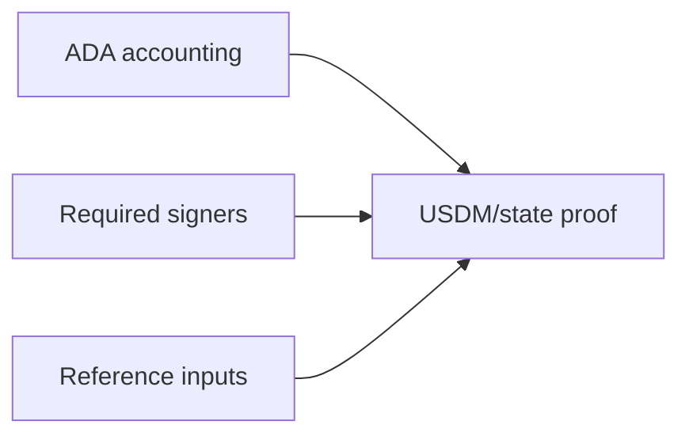

# ADA, Signers, And References

This section contains supporting transaction-body checks.

These queries are not the primary USDM balance proof, but they make the
report harder to fool. They show the ADA side of the same
network_compliance state movement, the signer distribution of the loaded
transactions, and the reference-input shape of the lattice.

## What Must Hold

The support checks should be coherent with the main state proof:

- ADA produced at network_compliance minus spent ADA minus terminal ADA
  should have zero gap,
- the largest ADA-producing outputs should explain the large
  state-rollover values,
- required-signer counts should match the expected transaction-body
  shapes,
- reused reference inputs should be visible as references, not confused
  with spend ancestry.

## Query Roles

- [Query 03 - Network compliance ADA accounting](03-network-compliance-ada-accounting.md)
  is the ADA-side conservation check.
- [Query 06 - Network compliance ADA producers](06-network-compliance-ada-producers.md)
  lists the largest ADA outputs to network_compliance.
- [Query 04 - Required signer distribution](04-required-signer-distribution.md)
  groups transactions by required-signer count.
- [Query 09 - Reference input reuse](09-reference-input-reuse.md)
  shows the most reused reference inputs.

