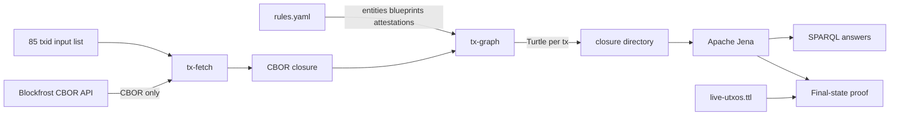

# Amaru Treasury - May 2026 85-Tx Lattice Report

Direct network-state SPARQL report running over a real 85-transaction
on-chain lattice built end-to-end from `tx-fetch` + `tx-graph` + Apache
Jena.

- Network-scope transaction set — the 85 txids that touch the
  `amaru-treasury.network_compliance` address during the report window.
  The report treats this list as an input boundary selected from the
  address history described below.
- Closure — fetched by `tx-fetch` from Blockfrost via
  `/txs/<hash>/cbor` *only*
  (no `/utxos`, no `/inputs`, no `/outputs`). Fetch depth is `0`: no
  generic parent walk is needed for the network treasury final-state
  proof because every in-scope producer/spender transaction is already
  in the 85-tx list.
- Emission — `tx-graph --rules rules.yaml --in-dir closure/cbor
  --out-dir closure` indexes every fetched CBOR by computed transaction
  id and emits one canonical Turtle file per transaction.
- State boundary — the final UTxO state is recomputed from graph topology:
  outputs to the network treasury minus outputs whose `(txid, index)` is
  consumed by another transaction in the same 85-tx graph.
- Total graph size = **85 network-scope txs**, each in
  its own canonical Turtle file under `closure/<txid>.ttl`.
- State-audit boundary — Queries 14-16 use the 85-tx
  network_compliance address history through the live snapshot boundary
  (block 13,467,438; slot 188,217,701). Query 14 is graph-only. Queries
  15-16 compare that graph-derived state with the separate live snapshot
  in `live-utxos.ttl`.
- USDM accounting boundary — Queries 17-21 turn that complete
  network_compliance graph into a user-facing proof: the treasury starts
  with 0 USDM, receives 425,131.618692 USDM from swaps, pays 418,750 USDM
  to the CAG payee bridge, and retains 6,381.618692 USDM with zero
  accounting gap.
- Operator rules — `rules.yaml` carries on-chain entities, off-chain
  vendors, IPFS-anchored attestations, and CIP-57 blueprints.
- Engine — Apache Jena 5.6.0 `sparql` CLI.



## Initial Conditions And Txid Selection

The SPARQL queries are integrals over a bounded transaction lattice.
They prove conservation and final state for that interval; they do not
magically infer the opening state. A correct report therefore needs two
inputs before the queries make sense:

- a valid initial condition for the scope being audited,
- a txid set that is complete for all in-interval changes to that
  scope.

For this report, the boundary is not a generic parent walk and it is not
the full ancestry of every transaction. It is the complete
network_compliance address-history slice for the state interval being
audited, paired with the initial condition that the scoped address held
`0 USDM` at the beginning of the interval.

The selection rule used here was:

1. Choose the scope address:
   `amaru-treasury.network_compliance`
   (`addr1xyezq8wpaqnssdjvd3p220uf7e6nzjae44w6yu625y965rfjyqwur6p8pqmycmzz55lcnan4x99mnt2a5fe54ggt4gxs8thzgk`).
2. Choose and document the initial condition. For the May 2026 report,
   the initial condition is that the scope address has `0 USDM` at the
   start boundary.
3. Choose the end boundary used for the live-state comparison:
   block `13,467,438`, slot `188,217,701`.
4. Enumerate the Blockfrost address transaction history for the scope
   address through that boundary.
5. Keep the transactions in the report interval that touch the address,
   meaning transactions that either produce an output at the address or
   spend a previous output from the address.
6. Record the resulting 85 txids in
   [`network-txs.txt`](network-txs.txt).
7. Fetch exactly those 85 transactions with `tx-fetch --depth 0`, emit
   the graph with `tx-graph`, and verify terminal state with Queries
   14-16.

The operational Blockfrost step is an address-history query, for
example:

```bash
ADDRESS=addr1xyezq8wpaqnssdjvd3p220uf7e6nzjae44w6yu625y965rfjyqwur6p8pqmycmzz55lcnan4x99mnt2a5fe54ggt4gxs8thzgk

curl -sS \
  -H "project_id: $BLOCKFROST_PROJECT_ID" \
  "https://cardano-mainnet.blockfrost.io/api/v0/addresses/$ADDRESS/transactions?order=asc&page=1&count=100"
```

Repeat the paginated query until the chosen end boundary is reached,
then persist the selected `tx_hash` values as one txid per line. The
persisted file is the audit boundary; `tx-fetch` only retrieves and
hash-verifies the CBOR for that boundary.

This selection is correct for a final-state proof when the initial
condition is true and the selected txid set is state-complete for the
scope address: every in-interval producer and spender of the address is
included. If a previous address UTxO exists at the start boundary, the
report must include that opening UTxO state explicitly. Moving the start
boundary back to a point where the address is empty is just the special
case where the opening state is zero.

With those inputs, the SPARQL queries behave like ledger integrals:

```text
opening state + in-interval inflows - in-interval outflows = terminal state
```

If the equation does not match the live terminal state, the bug is in
one of three places: the opening state is wrong, the txid set is
incomplete, or the graph/query emission is wrong.

The report verifies the selection in two ways:

- Query 14 recomputes terminal UTxOs from graph topology alone.
- Queries 15-16 compare the graph-derived terminal UTxOs with the
  separate live UTxO snapshot at the selected end boundary. A non-zero
  diff means the txid set is incomplete or the boundary was chosen
  incorrectly.

## Report Queries

The proof inputs and query sources are standalone files. Every query
linked below runs against the same 85-transaction lattice. The tree is
grouped by the question a reader is trying to answer first.

Rules source: [`rules.yaml`](rules.yaml)

Network-scope txids: [`network-txs.txt`](network-txs.txt)

Live UTxO snapshot for Queries 15-16:
[`live-utxos.ttl`](live-utxos.ttl)

The query pages are listed in the site navigation under this report,
grouped by boundary shape, terminal state, USDM movement, swaps, and
supporting transaction-body checks.
