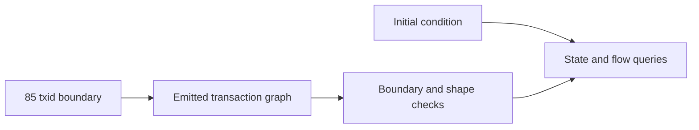

# Lattice Boundary And Shape

This section is load-bearing: it defines what graph the report is
allowed to integrate over.

The May report does not query an unbounded chain history and it does not
walk transaction parents until genesis. It queries the selected
85-transaction address-history lattice for
`amaru-treasury.network_compliance`, paired with the documented initial
condition for the audited interval.

If this boundary is wrong, every balance query downstream can be
internally consistent and still answer the wrong question.

## What Must Hold

The selected txid set must be complete for the scoped state interval:

- every transaction that produces an output at network_compliance is in
  the set,
- every transaction that spends an in-scope network_compliance output is
  in the set,
- the opening state is documented separately,
- the terminal state is checked against the live UTxO snapshot.

## Query Roles

- [Query 00 - Lattice inventory](00-lattice-inventory.md)
  proves the graph has 85 transaction nodes and exposes its edge counts.
- [Query 01 - Network compliance touch summary](01-network-compliance-touch-summary.md)
  classifies which loaded transactions produce or roll forward the
  scope address.
- [Query 12 - Lattice input coverage](12-lattice-input-coverage.md)
  shows which input edges resolve inside the selected lattice and which
  point outside it.
- [Query 13 - Lattice output assets](13-lattice-output-assets.md)
  shows the gross asset surface emitted by the lattice.

