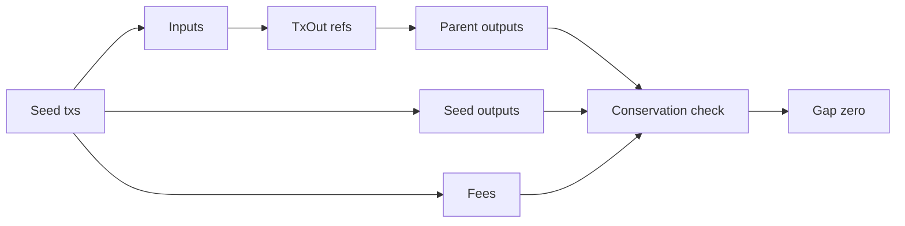

# Query 00 - ADA Conservation

Runnable SPARQL: [`00-ada-conservation.rq`](00-ada-conservation.rq)

Back to the [May 2026 lattice demo](../../may-2026-amaru-lattice.md).

## What

This query asks whether the seed transactions conserve ADA at the UTxO
level. It totals the lovelace consumed by every seed transaction input,
then compares that number with the lovelace emitted by seed outputs plus
the fees paid by the seed transactions.

The intended answer is a single row with a `gap` of zero. A zero gap
means the loaded graph has enough parent transactions to resolve the
seed inputs and that the emitted output and fee predicates are internally
consistent.

This is not a claim about the whole Cardano ledger. It does not model
deposits, rewards, minting, burning, treasury withdrawals, or later
transactions outside the loaded interval. It is deliberately narrower:
for the May seed transaction set, the ADA UTxO accounting must balance.

## Why

Every higher-level flow query depends on this invariant. If the graph
cannot conserve lovelace, then any statement like "network_compliance
sent ADA to swap.v2" or "the contingency disbursement was 205k ADA" is
not yet trustworthy, because an input or output might be missing.

This is the first proof gate for graph correctness. It catches missing
closure transactions, broken `fromTxOutRef` links, missing output indexes,
and wrong fee emission before the demo moves on to business-specific
questions.

## Diagram



## How

The input side starts at every `cardano:hasLatticeRole "seed"`
transaction and follows `cardano:hasInput` to the referenced
`cardano:fromTxOutRef`. The reference gives `(parent txid, output index)`.
The query joins that pair back to the parent transaction in the closure
and reads the parent output's `cardano:lovelace`.

The output side sums `cardano:lovelace` on every seed output. A separate
subquery sums `cardano:hasFee` for the same seed transactions. The final
projection computes:

```text
input lovelace - output lovelace - fee lovelace
```

If the graph is complete for the seed inputs, the expression is zero.
If it is non-zero, the next debugging step is Query 12, which identifies
whether any seed input failed to resolve to exactly one parent output.
