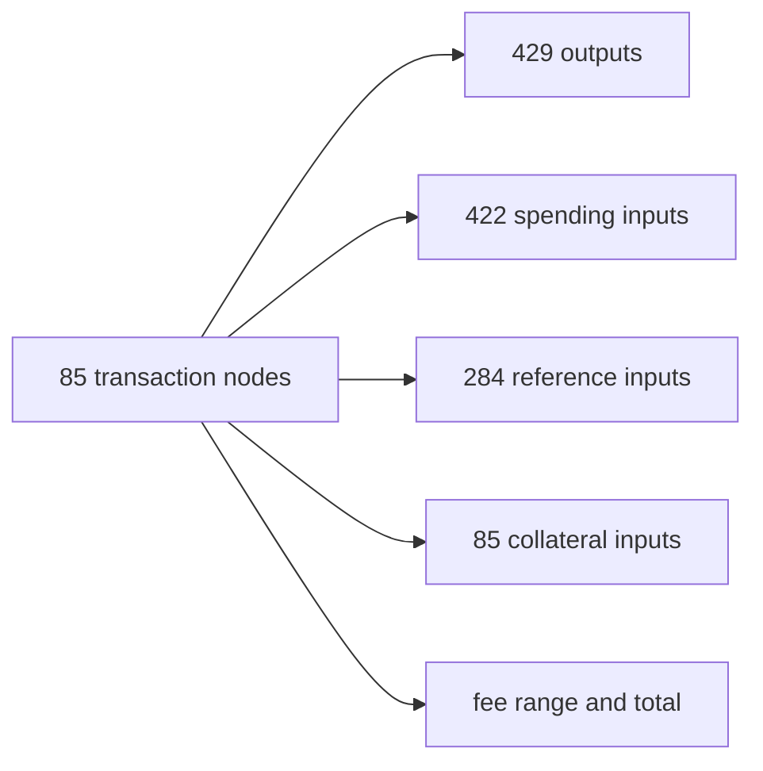

# Query 00 - Lattice Inventory

Runnable SPARQL: [`00-lattice-inventory.rq`](00-lattice-inventory.rq)

## Result

This table is the CSV result produced by Apache Jena over the
85-transaction graph. ADA quantities are decimal ADA.

| transactions | outputs | spendingInputs | referenceInputs | collateralInputs | totalFeeAda | minFeeAda | maxFeeAda |
| ---: | ---: | ---: | ---: | ---: | ---: | ---: | ---: |
| 85 | 429 | 422 | 284 | 85 | 57.138022 | 0.244261 | 1.572508 |

## What

This is the structural inventory of the loaded lattice. It answers the
first sanity question: "what graph did the rest of the report actually
query?"

The answer is 85 transaction subjects, 429 outputs, 422 spending-input
edges, 284 reference-input edges, and 85 collateral-input edges.

## Why

Every later proof depends on this boundary being explicit. If the query
accidentally counts referenced transaction ids or overlay metadata as
transactions, the rest of the report can look plausible while running on
the wrong shape.

This query therefore counts only RDF subjects typed as
`cardano:Transaction` for the transaction total. The remaining columns
count emitted graph edges.

## Diagram



## How

The query uses independent aggregate subqueries so that outputs, inputs,
references, collateral inputs, and fees do not multiply each other in a
single large join.

The transaction aggregate is restricted to `a cardano:Transaction`.
That distinction matters because transaction-output references also
contain transaction ids, but they are not transactions in the loaded
graph.

## SPARQL

```sparql
--8<-- "docs/may-2026-amaru-lattice/queries/00-lattice-inventory.rq"
```
