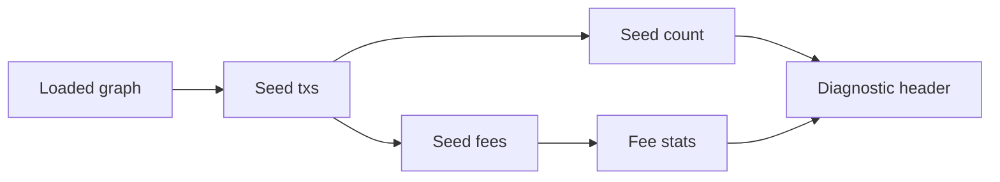

# Query 01 - Monthly Totals

Runnable SPARQL: [`01-monthly-totals.rq`](01-monthly-totals.rq)

Back to the [May 2026 lattice demo](../../may-2026-amaru-lattice.md).

## What

This query summarizes the seed set itself. It counts the transactions
marked `cardano:hasLatticeRole "seed"` and reports the total, minimum,
and maximum fee paid by those transactions.

The seed set is the operator-named May 2026 batch: disbursements,
reorganizations, swap orders, a swap cancel, and a scoop transaction.
The query does not count closure parents as activity in the May batch;
parents are loaded only to resolve the UTxOs consumed by the seeds.

## Why

Before proving flows, the demo needs to prove that it is querying the
expected window. A seed count that is too low means the input list is
missing transactions. A seed count that is too high usually means the
closure role tagging is wrong and parent transactions are being counted
as May activity.

The fee statistics also give a useful shape check. A high maximum fee
corresponds to the complex multisig and reference-input transactions,
while low fees correspond to simpler swap-order opens. If these numbers
move unexpectedly, the seed set or tx parsing has changed.

## Diagram



## How

The query is intentionally small. It scans only transactions with the
`seed` lattice role and aggregates `cardano:hasFee`.

The role split is important. The lattice contains both seed transactions
and parent transactions. Parent transactions are evidence needed for
input resolution, but they are not part of the May operation being
measured. Keeping that distinction in the graph lets every other query
say "flows caused by the seed set" rather than "flows visible anywhere
in all loaded transactions."

The result is a diagnostic header for the rest of the bundle. If this
row is wrong, do not interpret the later business queries until the seed
list and lattice-role tagging are fixed.

## SPARQL

```sparql
PREFIX cardano: <https://lambdasistemi.github.io/cardano-knowledge-maps/vocab/cardano#>

SELECT (COUNT(?tx) AS ?seedTxCount)
       (SUM(?fee) AS ?totalFeeLovelace)
       (MIN(?fee) AS ?minFee)
       (MAX(?fee) AS ?maxFee)
WHERE {
  ?tx cardano:hasLatticeRole "seed" ;
      cardano:hasFee ?fee .
}

```

## Result

This table is the CSV result produced by Apache Jena over the May 2026 lattice. ADA quantities are lovelace; USDM quantities are base units.

| seedTxCount | totalFeeLovelace | minFee | maxFee |
|---|---|---|---|
| 30 | 19931398 | 244261 | 1572508 |
