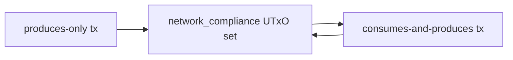

# Query 01 - Network Compliance Touch Summary

Runnable SPARQL: [`01-network-compliance-touch-summary.rq`](01-network-compliance-touch-summary.rq)

Back to the [May 2026 lattice demo](../../may-2026-amaru-lattice.md).

## Result

| touchKind | txs |
| --- | ---: |
| consumes-and-produces | 31 |
| produces-only | 54 |

## What

This query classifies every transaction that touches the
`amaru-treasury.network_compliance` address.

A transaction is `produces-only` when it creates a network_compliance
output and does not spend a previous one in the loaded lattice. A
transaction is `consumes-and-produces` when it spends a resolved
network_compliance output and emits a new one.

## Why

This tells us how the address state evolves inside the 85 transactions.
The 54 `produces-only` transactions introduce outputs at the treasury
address. The 31 `consumes-and-produces` transactions roll an existing
treasury UTxO forward.

There are no `consumes-only` rows in this result, which is consistent
with the later terminal-state proof: every in-scope treasury spend also
produces a replacement or payment/change shape visible in the graph.

## Diagram



## How

The query resolves the network_compliance bech32 address from
`rules.yaml`, then computes two boolean tests per transaction.

The first test checks whether the transaction emits an output at that
address. The second test follows each input reference back to a loaded
output and checks whether the source output was at the same address.

The final `touchKind` is derived from those two tests.

## SPARQL

```sparql
--8<-- "docs/may-2026-amaru-lattice/queries/01-network-compliance-touch-summary.rq"
```
