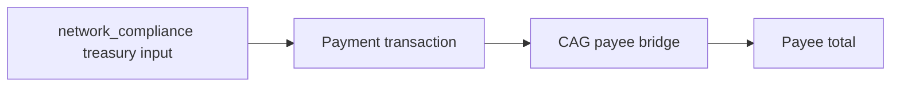

# Query 02 - Treasury USDM Payees

Runnable SPARQL: [`02-usdm-output-addresses.rq`](02-usdm-output-addresses.rq)

Back to the [May 2026 lattice demo](../../may-2026-amaru-lattice.md).


## Result

This table is the CSV result produced by Apache Jena over the
state-audit graph. USDM quantities are decimal USDM.

| treasuryLabel | treasuryAddress | payeeLabel | payeeAddress | paymentTxs | paymentOutputs | usdmPaid |
| --- | --- | --- | --- | ---: | ---: | ---: |
| amaru-treasury.network_compliance | `addr1xyezq8wpaqnssdjvd3p220uf7e6nzjae44w6yu625y965rfjyqwur6p8pqmycmzz55lcnan4x99mnt2a5fe54ggt4gxs8thzgk` | amaru.cag-payee | `addr1q8qrds2nnx7clx3kcpp2l0eu45twmdcahsfu9m0xcwy59j6xz3vs0hnfaz9nhje8z34kfnds4jyk7hs6dnrag6e2lfgqtyf4rl` | 2 | 2 | 418750.000000 |

```text
418,750.000000 USDM paid by network_compliance to the CAG payee bridge
```

## What

This query lists USDM recipients paid by the
`amaru-treasury.network_compliance` treasury. It is deliberately narrower
than a raw "all USDM outputs" query: a row is included only when the
transaction consumes a network_compliance treasury input and emits USDM
to a configured payee bridge.

For May 2026, the graph returns one payee: `amaru.cag-payee`.

## Why

A raw output-side query over every USDM output in the graph is too broad
for the user question "who did the treasury pay USDM to?" because it
mixes three different concepts:

- network_compliance treasury change,
- swap-side script outputs,
- actual beneficiary/payee outputs.

The source proof is therefore part of the query. A counted payment
transaction must consume a UTxO from `network_compliance`, and the
counted output must go to the configured CAG payee bridge. USDM outputs
that do not satisfy both conditions are not treasury payees.

## Diagram



## How

The query pins the full on-chain USDM asset id in a `VALUES` block and
resolves both the treasury address and CAG payee address through
`rules.yaml` labels.

It scans USDM outputs to the configured payee bridge, then applies an
`EXISTS` source proof:

```sparql
FILTER EXISTS {
  ?paymentTx cardano:hasInput ?input .
  ?input cardano:fromTxOutRef ?ref .
  ?ref cardano:hasTxId/cardano:bytesHex ?sourceTxId ;
       cardano:hasIndex ?sourceIx .
  ?sourceTx cardano:hasTxId/cardano:bytesHex ?sourceTxId ;
            cardano:hasOutput ?sourceOut .
  ?sourceOut cardano:hasIndex ?sourceIx ;
             cardano:atAddress/cardano:bech32 ?treasuryAddress .
}
```

That is the key distinction: the output is counted only if the same
transaction spends a resolved UTxO from the network_compliance treasury.

The inner subquery groups by paid ledger output before the outer payee
aggregation. That prevents multiple treasury inputs in one transaction
from multiplying the paid output amount.

## SPARQL

```sparql
--8<-- "docs/may-2026-amaru-lattice/queries/02-usdm-output-addresses.rq"
```
