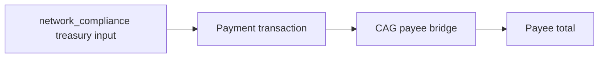

# Query 02 - Treasury USDM Payees

Runnable SPARQL: [`02-usdm-output-addresses.rq`](02-usdm-output-addresses.rq)

Back to the [May 2026 lattice demo](../../may-2026-amaru-lattice.md).

## What

This query lists USDM recipients paid by the
`amaru-treasury.network_compliance` treasury. It is deliberately narrower
than a raw "all USDM outputs" query: a row is included only when the
transaction consumes a network_compliance treasury input and emits USDM
to a configured payee bridge.

For May 2026, the graph returns one payee: `amaru.cag-payee`.

## Why

The previous version of this query counted every seed output carrying
USDM. That was too broad for the user question "who did the treasury pay
USDM to?" because it mixed three different concepts:

- network_compliance treasury change,
- swap-side script outputs,
- actual beneficiary/payee outputs.

The important bug is that `seed` was being used as if it meant "spent
from our treasury". It does not. `cardano:hasLatticeRole "seed"` only
means the transaction is one of the loaded May transactions. The old
query had this output-side shape:

```sparql
?seed cardano:hasLatticeRole "seed" ;
      cardano:hasOutput ?out .
```

It did not require the transaction to consume a UTxO from
network_compliance. So the unlabelled row appeared precisely because
the query was not proving source.

That is why the old page showed an `unlabelled` row. It was not a
beneficiary payment. It was a script address output from swap producer
transaction `4e2642080c8d171aad05baed11b076de498b76acecc1c2412660048fae8aefa3`,
which consumed nine Sundae V3 order inputs and emitted
`490,819.149109` USDM to a script address not declared in `rules.yaml`.
The graph could show the address and credentials, but no rule label
existed for that address, so the broad query called it `unlabelled`.

## Diagram



## How

The query pins the full on-chain USDM asset id in a `VALUES` block and
resolves both the treasury address and CAG payee address through
`rules.yaml` labels.

It scans USDM outputs to the configured payee bridge, then applies an
`EXISTS` source proof:

```sparql
FILTER EXISTS {
  ?paymentTx cardano:hasInput ?input .
  ?input cardano:fromTxOutRef ?ref .
  ?ref cardano:hasTxId/cardano:bytesHex ?sourceTxId ;
       cardano:hasIndex ?sourceIx .
  ?sourceTx cardano:hasTxId/cardano:bytesHex ?sourceTxId ;
            cardano:hasOutput ?sourceOut .
  ?sourceOut cardano:hasIndex ?sourceIx ;
             cardano:atAddress/cardano:bech32 ?treasuryAddress .
}
```

That is the key distinction: the output is counted only if the same
transaction spends a resolved UTxO from the network_compliance treasury.

The inner subquery groups by paid ledger output before the outer payee
aggregation. That prevents multiple treasury inputs in one transaction
from multiplying the paid output amount.

## SPARQL

```sparql
--8<-- "docs/may-2026-amaru-lattice/queries/02-usdm-output-addresses.rq"
```

## Result

This table is the CSV result produced by Apache Jena over the
state-audit graph. USDM quantities are decimal USDM.

| treasuryLabel | payeeLabel | paymentTxs | paymentOutputs | usdmPaid |
|---|---|---:|---:|---:|
| amaru-treasury.network_compliance | amaru.cag-payee | 2 | 2 | 418750.000000 |

```text
418,750.000000 USDM paid by network_compliance to the CAG payee bridge
```
