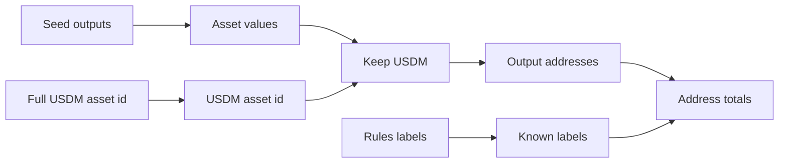

# Query 02 - USDM Output Addresses

Runnable SPARQL: [`02-usdm-output-addresses.rq`](02-usdm-output-addresses.rq)

Back to the [May 2026 lattice demo](../../may-2026-amaru-lattice.md).

## What

This query lists every address that received USDM from a seed
transaction and sums the USDM quantity per address. When the address is
declared in `rules.yaml`, the query also returns the human-readable
label emitted by the graph.

It answers a direct question: "Where did the USDM outputs go in this
May batch?" It does not yet decide whether a destination is final, change,
pool inventory, or an intermediate script. It only reports output-side
USDM created by the seed transactions.

## Why

This is the first USDM-specific lens. It quickly separates the large
destinations: network compliance change, CAG payee, SundaeSwap pool or
settlement outputs, and any unlabelled wallet outputs.

The query is useful because it avoids narrative mistakes. Seeing USDM at
network_compliance in this output table is not a loss; it can be change
or terminal residual. Later queries compare input and output sides, and
Queries 11, 14, 15, and 16 answer the terminal-state question.

## Diagram



## How

The query pins the full on-chain USDM asset id in a `VALUES` block:
policy id plus the complete asset-name bytes. The May asset name is not
plain ASCII `USDM`; it includes the on-chain label prefix
`0014df10`, so the query uses the exact bytes emitted in the graph.

It then scans seed outputs, follows `cardano:hasAssetValue` through the
RDF list of multi-asset quantities, and keeps only assets whose
identifier matches USDM. For each matching output, it reads the output
address via `cardano:atAddress/cardano:bech32`.

An optional join maps the bech32 address back to a rules entity:

```sparql
?labelEntity cardano:bech32 ?outputBech32 ;
             rdfs:label ?knownLabel .
```

That join is why the rendered answer can show both the concrete address
and an operator label where one exists. Unknown addresses are kept as
`unlabelled`, which is important for auditability; the query does not
drop facts just because the operator did not pre-name an address.

## SPARQL

```sparql
PREFIX cardano: <https://lambdasistemi.github.io/cardano-knowledge-maps/vocab/cardano#>
PREFIX rdf:     <http://www.w3.org/1999/02/22-rdf-syntax-ns#>
PREFIX rdfs:    <http://www.w3.org/2000/01/rdf-schema#>

SELECT ?outputBech32 ?outputLabel (SUM(?qty) AS ?usdmOutput)
WHERE {
  VALUES ?usdmAssetId {
    "c48cbb3d5e57ed56e276bc45f99ab39abe94e6cd7ac39fb402da47ad0014df105553444d"
  }

  ?seed cardano:hasLatticeRole "seed" ;
        cardano:hasOutput ?out .
  ?out cardano:atAddress/cardano:bech32 ?outputBech32 ;
       cardano:hasAssetValue/rdf:rest*/rdf:first ?asset .
  ?asset cardano:hasIdentifier/cardano:bytesHex ?usdmAssetId ;
         cardano:quantity ?qty .

  OPTIONAL {
    ?labelEntity cardano:bech32 ?outputBech32 ;
                 rdfs:label ?knownLabel .
  }
  BIND (COALESCE(?knownLabel, "unlabelled") AS ?outputLabel)
}
GROUP BY ?outputBech32 ?outputLabel
ORDER BY DESC(?usdmOutput)

```

## Result

This table is the CSV result produced by Apache Jena over the May 2026 lattice. ADA quantities are lovelace; USDM quantities are base units.

| outputBech32 | outputLabel | usdmOutput |
|---|---|---|
| addr1xyezq8wpaqnssdjvd3p220uf7e6nzjae44w6yu625y965rfjyqwur6p8pqmycmzz55lcnan4x99mnt2a5fe54ggt4gxs8thzgk | amaru-treasury.network_compliance | 1146156659602 |
| addr1z8srqftqemf0mjlukfszd97ljuxdp44r372txfcr75wrz2auzrlrz2kdd83wzt9u9n9qt2swgvhrmmn96k55nq6yuj4qw992w9 | unlabelled | 490819149109 |
| addr1q8qrds2nnx7clx3kcpp2l0eu45twmdcahsfu9m0xcwy59j6xz3vs0hnfaz9nhje8z34kfnds4jyk7hs6dnrag6e2lfgqtyf4rl | amaru.cag-payee | 418750000000 |
