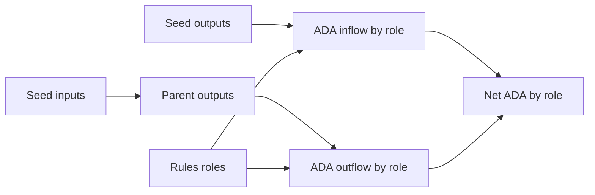

# Query 03 - ADA Role Flow

Runnable SPARQL: [`03-ada-role-flow.rq`](03-ada-role-flow.rq)

Back to the [May 2026 lattice demo](../../may-2026-amaru-lattice.md).

## What

This query computes ADA flow by ledger role. For each role, it reports
lovelace entering that role through seed outputs, lovelace leaving that
role through closure-resolved seed inputs, and the net delta.

Roles are derived from graph facts emitted from `rules.yaml`, not from a
hard-coded address map inside the query. Named treasury addresses,
bridge addresses, script credentials, and assets can all be recognized
by joining to the emitted entity overlay.

## Why

This is the ADA flow view that turns a pile of transactions into an
accounting statement. It distinguishes contingency, network compliance,
Sundae V3 order-script UTxOs, CAG payee, operator wallet, and
unlabelled wallets so we can ask whether value moved through the
expected scopes.

The query also prevents the old "other bucket" problem. If all unknown
and script-controlled addresses are collapsed too early, the graph can
appear to say that one treasury "lost" value. Keeping roles separate
shows whether value went to a Sundae V3 order script, a pool, a bridge
output, a wallet, or back to treasury change.

## Diagram



## How

The query has two symmetric branches.

The output branch reads every seed output's `cardano:lovelace`, address,
and optional payment credential hash. That amount is counted as
`lovelace_in` for the destination role.

The input branch follows each seed input through `cardano:fromTxOutRef`
to the parent transaction and output index. It reads the parent output's
lovelace and address. That amount is counted as `lovelace_out` for the
source role.

After both branches produce `(bech32, payment hash, in, out)` rows, two
optional role lookups run:

```sparql
?entity cardano:bech32 ?bech ;
        rdfs:label ?label .
```

for address-level labels, and:

```sparql
?entity cardano:hasIdentifier ?id .
?id cardano:bytesHex ?payHash .
```

for script or credential-level labels. The final role is
`COALESCE(addressRole, credentialRole, "wallet.other")`.

The net is `SUM(lovelace_in) - SUM(lovelace_out)`. A positive net means
the role ended the seed set with more ADA than it started with. A
negative net means the seed set spent more ADA from that role than it
returned to it.

## SPARQL

```sparql
PREFIX cardano: <https://lambdasistemi.github.io/cardano-knowledge-maps/vocab/cardano#>
PREFIX rdfs:    <http://www.w3.org/2000/01/rdf-schema#>

# ADA flow by ledger role. This deliberately keeps AMM pool state,
# swap-order script UTxOs, treasury UTxOs, bridge outputs, and ordinary
# wallets in separate buckets; collapsing them into "other" produces
# misleading business interpretations.
SELECT ?role
       (SUM(?lovIn) AS ?lovelace_in)
       (SUM(?lovOut) AS ?lovelace_out)
       ((SUM(?lovIn) - SUM(?lovOut)) AS ?net_lovelace)
WHERE {
  {
    ?seed cardano:hasLatticeRole "seed" ;
          cardano:hasOutput ?out .
    ?out cardano:atAddress ?addr ;
         cardano:lovelace ?lovIn .
    ?addr cardano:bech32 ?bech .
    OPTIONAL {
      ?addr cardano:hasPaymentCredential/cardano:hasIdentifier/cardano:bytesHex ?payHash .
    }
    BIND (0 AS ?lovOut)
  }
  UNION
  {
    ?seed cardano:hasLatticeRole "seed" ;
          cardano:hasInput ?in .
    ?in cardano:fromTxOutRef ?ref .
    ?ref cardano:hasTxId/cardano:bytesHex ?parentHex ;
         cardano:hasIndex ?ix .
    ?parent cardano:hasTxId/cardano:bytesHex ?parentHex ;
            cardano:hasOutput ?parentOut .
    ?parentOut cardano:hasIndex ?ix ;
               cardano:atAddress ?addr ;
               cardano:lovelace ?lovOut .
    ?addr cardano:bech32 ?bech .
    OPTIONAL {
      ?addr cardano:hasPaymentCredential/cardano:hasIdentifier/cardano:bytesHex ?payHash .
    }
    BIND (0 AS ?lovIn)
  }

  OPTIONAL {
    {
      SELECT ?bech (SAMPLE(?label) AS ?addressRole)
      WHERE {
        ?entity cardano:bech32 ?bech ;
                rdfs:label ?label .
      }
      GROUP BY ?bech
    }
  }
  OPTIONAL {
    {
      SELECT ?payHash (SAMPLE(?label) AS ?credentialRole)
      WHERE {
        ?entity rdfs:label ?label ;
                cardano:hasIdentifier ?id .
        ?id cardano:bytesHex ?payHash .
        FILTER NOT EXISTS { ?entity cardano:bech32 ?_address . }
      }
      GROUP BY ?payHash
    }
  }
  BIND (COALESCE(?addressRole, ?credentialRole, "wallet.other") AS ?role)
}
GROUP BY ?role
ORDER BY ?role

```

## Result

This table is the CSV result produced by Apache Jena over the May 2026 lattice. ADA quantities are lovelace; USDM quantities are base units.

| role | lovelace_in | lovelace_out | net_lovelace |
|---|---|---|---|
| amaru-treasury.contingency | 3852000000000 | 4057000000000 | -205000000000 |
| amaru-treasury.network_compliance | 14923951458216 | 16209772179866 | -1285820721650 |
| amaru.cag-payee | 2379120 | 0 | 2379120 |
| amaru.network-operator | 2391518562 | 2410553271 | -19034709 |
| amaru.swap-order | 1543640747472 | 90940160191 | 1452700587281 |
| sundae.swap.v3.order | 0 | 26240000 | -26240000 |
| wallet.other | 1864091867622 | 1825948769062 | 38143098560 |
