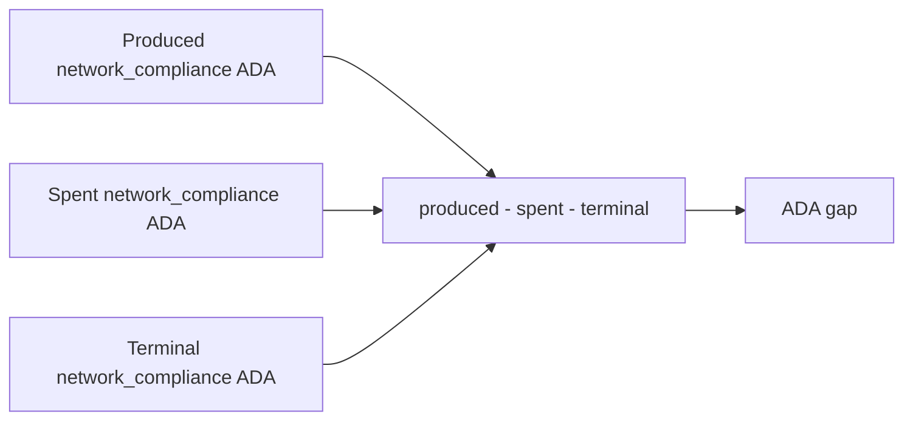

# Query 03 - Network Compliance ADA Accounting

Runnable SPARQL: [`03-network-compliance-ada-accounting.rq`](03-network-compliance-ada-accounting.rq)

## Result

ADA quantities are decimal ADA.

| producedOutputs | producedAda | spentOutputs | spentAda | terminalOutputs | terminalAda | adaGap |
| ---: | ---: | ---: | ---: | ---: | ---: | ---: |
| 88 | 16621674.531828 | 83 | 16621545.314556 | 5 | 129.217272 | 0.000000 |

```text
16,621,674.531828 - 16,621,545.314556 - 129.217272 = 0
```

## What

This is the ADA-side state equation for network_compliance outputs in
the lattice.

It totals ADA produced at the address, subtracts ADA from produced
outputs that are later spent inside the same graph, and compares the
remainder with the terminal ADA still present at the address.

## Why

The USDM proof is the user-facing question, but the same UTxOs also
carry ADA. A broken terminal-state computation can hide in the ADA side
even when the token arithmetic looks right.

The zero `adaGap` shows that the graph topology also recomputes the ADA
state of the treasury address.

## Diagram



## How

The query runs three subqueries over outputs at the
network_compliance address.

The produced subquery sums every emitted output at the address. The
spent subquery keeps only those outputs whose `(txid, index)` is
referenced by another loaded transaction input. The terminal subquery
keeps the complement: outputs at the address with no matching spender in
the loaded graph.

The final projection subtracts those totals in base ADA units and
displays decimal ADA.

## SPARQL

```sparql
--8<-- "docs/may-2026-amaru-lattice/queries/03-network-compliance-ada-accounting.rq"
```
