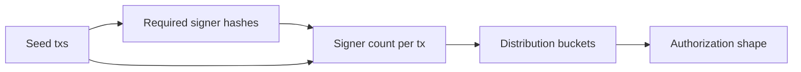

# Query 04 - Required Signer Distribution

Runnable SPARQL: [`04-required-signer-distribution.rq`](04-required-signer-distribution.rq)

Back to the [May 2026 lattice demo](../../may-2026-amaru-lattice.md).

## What

This query counts how many seed transactions required zero, one, two, or
more key signers. It groups seed transactions by the number of distinct
`cardano:hasRequiredSigner` entries attached to each transaction.

The answer is a shape distribution, not a signature verification. It
shows the authorization pattern encoded in the transaction bodies.

## Why

Different treasury actions have different expected authorization
shapes. The contingency disbursement should be more heavily authorized
than a simple swap order. Vendor-payment and reorganization transactions
should not look like unauthenticated script-only movements if the
operational policy expects signer participation.

The query is a quick governance sanity check. If a high-authority action
shows up with too few required signers, that is worth investigating even
if the transaction was valid on-chain. Conversely, seeing the expected
4-of-4 or 2-of-N shapes supports the claim that the graph exposes the
authorization surface needed for review.

## Diagram



## How

An inner query counts distinct required signer hashes per seed
transaction:

```sparql
COUNT(DISTINCT ?sig) AS ?requiredSigners
```

A union branch handles seed transactions with no required signer field,
binding their count to zero. That avoids silently dropping transactions
from the distribution just because the field is absent.

The outer query groups by `?requiredSigners` and counts transactions in
each group. The result is intentionally compact: it is not trying to
name each signer, only to prove that the graph carries the body-level
signer cardinality needed to distinguish transaction classes.

## SPARQL

```sparql
--8<-- "docs/may-2026-amaru-lattice/queries/04-required-signer-distribution.rq"
```

## Result

This table is the CSV result produced by Apache Jena over the May 2026
lattice.

| requiredSigners | txCount |
|---|---|
| 4 | 1 |
| 2 | 23 |
| 1 | 6 |
