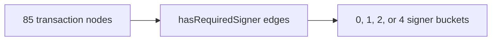

# Query 04 - Required Signer Distribution

Runnable SPARQL: [`04-required-signer-distribution.rq`](04-required-signer-distribution.rq)

Back to the [May 2026 lattice demo](../../may-2026-amaru-lattice.md).

## Result

| requiredSigners | txs |
| ---: | ---: |
| 4 | 1 |
| 2 | 27 |
| 1 | 56 |
| 0 | 1 |

## What

This query groups the 85 transaction nodes by how many required signer
credentials their bodies declare.

It is a transaction-body shape check, not a witness validation check.

## Why

Required signer distribution is useful when reading treasury activity
because it separates simple one-signer movements from multi-signer or
policy-gated actions. A sudden row with many unexpected signers, or many
zero-signer transactions, would be a reason to inspect the body set.

Here the distribution is compact: 84 of 85 transactions declare at least
one required signer, and one transaction declares none.

## Diagram



## How

The inner query groups by transaction node and counts distinct
`cardano:hasRequiredSigner` edges. It restricts the subject to
`a cardano:Transaction` so referenced transaction ids are not counted as
zero-signer transactions.

The outer query groups those per-transaction counts into the displayed
distribution.

## SPARQL

```sparql
--8<-- "docs/may-2026-amaru-lattice/queries/04-required-signer-distribution.rq"
```
