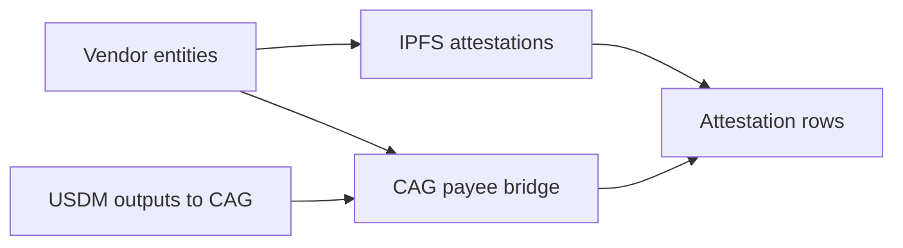

# Query 05 - Vendor Attestations

Runnable SPARQL: [`05-vendor-attestations.rq`](05-vendor-attestations.rq)

## Result

USDM quantities are decimal USDM. `bridgeUsdm` is the total USDM proven
to the CAG payee bridge, repeated as context for each attestation row; it
is not a per-attestation allocation.

| vendorLabel | payeeLabel | payeeAddress | attestationLabel | ipfs | bridgeUsdm |
| --- | --- | --- | --- | --- | ---: |
| amaru.antithesis | amaru.cag-payee | `addr1q8qrds2nnx7clx3kcpp2l0eu45twmdcahsfu9m0xcwy59j6xz3vs0hnfaz9nhje8z34kfnds4jyk7hs6dnrag6e2lfgqtyf4rl` | Invoice INV-635 | `ipfs://bafkreicnoadlgnc6cqxggxboho7yt532lkonxcusj3ndsxdnv5szyswyam` | 418750.000000 |
| amaru.castellum | amaru.cag-payee | `addr1q8qrds2nnx7clx3kcpp2l0eu45twmdcahsfu9m0xcwy59j6xz3vs0hnfaz9nhje8z34kfnds4jyk7hs6dnrag6e2lfgqtyf4rl` | Contract | `ipfs://bafybeib3jef34ndw6oe24mkmifdvxe5jrv7ulh63rdllovyth27mqfj2da` | 418750.000000 |
| amaru.castellum | amaru.cag-payee | `addr1q8qrds2nnx7clx3kcpp2l0eu45twmdcahsfu9m0xcwy59j6xz3vs0hnfaz9nhje8z34kfnds4jyk7hs6dnrag6e2lfgqtyf4rl` | Invoice #3508 | `ipfs://bafybeigy37ui2ikn7bim2vw6cojcbxkcndpjwh7cj5fv3vzs4cszezipxu` | 418750.000000 |
| amaru.castellum | amaru.cag-payee | `addr1q8qrds2nnx7clx3kcpp2l0eu45twmdcahsfu9m0xcwy59j6xz3vs0hnfaz9nhje8z34kfnds4jyk7hs6dnrag6e2lfgqtyf4rl` | May 2026 cycle review | `ipfs://bafybeihdmnitrbu2oir3r2fefnpqy3bk7zdz42olzmltmxyt5xag4i2t5a` | 418750.000000 |

## What

This query connects operator-declared vendor metadata to the ledger-side
CAG bridge payment total.

The graph proves the payment to `amaru.cag-payee`; the rules overlay
names the vendors and IPFS attestations that explain why that bridge
address is meaningful.

## Why

The ledger can prove "USDM went to this address." The operator rules add
the semantic layer: this address is the CAG payee bridge, and these
vendor attestations are associated with the payment context.

The query keeps the two layers visible in one result while avoiding a
false per-invoice split.

## Diagram



## How

Entity and attestation triples come from `rules.yaml` and are repeated in
every emitted transaction graph. The first subquery uses `SELECT
DISTINCT` to collapse those repeated overlay facts.

The second subquery sums USDM outputs to the payee bridge address from
the ledger graph. Joining the two subqueries gives each attestation row
the proven bridge total without multiplying the payment amount.

## SPARQL

```sparql
--8<-- "docs/may-2026-amaru-lattice/queries/05-vendor-attestations.rq"
```
