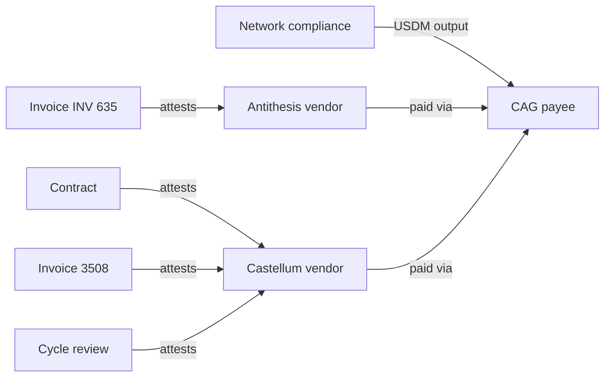

# Query 05 - Vendor-Payment Overlay

Runnable SPARQL: [`05-vendor-payment-overlay.rq`](05-vendor-payment-overlay.rq)

Back to the [May 2026 lattice demo](../../may-2026-amaru-lattice.md).


## Result

This table is the CSV result produced by Apache Jena over the May 2026
lattice. USDM quantities are decimal USDM.

| vendorLabel | attestationLabel | ipfs | usdmTotalAtBridge |
| --- | --- | --- | ---: |
| amaru.antithesis | Invoice INV-635 | ipfs://bafkreicnoadlgnc6cqxggxboho7yt532lkonxcusj3ndsxdnv5szyswyam | 418750.000000 |
| amaru.castellum | Contract | ipfs://bafybeib3jef34ndw6oe24mkmifdvxe5jrv7ulh63rdllovyth27mqfj2da | 418750.000000 |
| amaru.castellum | Invoice #3508 | ipfs://bafybeigy37ui2ikn7bim2vw6cojcbxkcndpjwh7cj5fv3vzs4cszezipxu | 418750.000000 |
| amaru.castellum | May 2026 cycle review | ipfs://bafybeihdmnitrbu2oir3r2fefnpqy3bk7zdz42olzmltmxyt5xag4i2t5a | 418750.000000 |

## What

This query connects on-chain USDM movement to off-chain vendor context.
It finds the USDM sent to the CAG payee address and joins that bridge
output to vendors and IPFS attestations declared in `rules.yaml`.

The result is not just "USDM reached this address". It says which
off-chain vendor entities are paid through that address and which
invoice, contract, or review artefacts are attached to those entities.

## Why

On-chain transactions can prove value movement, but they cannot by
themselves explain why a bridge address matters. The rules overlay gives
the graph enough operator context to answer a reviewer question:
"What vendor evidence is this payment connected to?"

This page is also the post-#105 simplification. The demo no longer needs
an extra `overlay.ttl` side input. `tx-graph --rules` emits the
off-chain facts as graph triples:

```text
cardano:OffChainEntity
cardano:paidVia
cardano:Attestation
cardano:attests
cardano:ipfs
```

That means the same rule source used to label on-chain addresses also
anchors the off-chain explanation.

## Diagram



## How

The subquery finds the bridge entity by label:

```sparql
?bridgeEntity rdfs:label "amaru.cag-payee" ;
              cardano:bech32 ?bridgeBech32 .
```

It also pins the full on-chain USDM asset id in a `VALUES` block. It
then scans seed outputs at the bridge address, follows the multi-asset
RDF list, and sums USDM quantity.

The outer query joins vendors to the same bridge entity:

```sparql
?vendor cardano:paidVia ?bridgeEntity .
```

Then it joins attestations to those vendors:

```sparql
?attestation cardano:attests ?vendor ;
             cardano:ipfs ?ipfs .
```

The important correctness property is that the bridge amount and the
vendor evidence are not stitched together by a presentation script. They
are joined inside SPARQL over one emitted graph.

## SPARQL

```sparql
--8<-- "docs/may-2026-amaru-lattice/queries/05-vendor-payment-overlay.rq"
```
