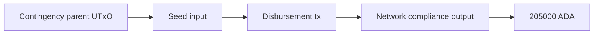

# Query 06 - Disbursement Candidates

Runnable SPARQL: [`06-disbursement-candidates.rq`](06-disbursement-candidates.rq)

Back to the [May 2026 lattice demo](../../may-2026-amaru-lattice.md).

## What

This query finds seed transactions that consume a contingency UTxO and
emit ADA to the network_compliance treasury address. It reports the seed
transaction id and the lovelace amount sent to network_compliance.

It is a structural disbursement detector. It does not depend on typed
redeemer decoding and it does not need to understand the treasury
contract's business-level constructor names.

## Why

The review needs to prove that the 205k ADA movement from contingency to
network_compliance can be recovered from the graph. If the graph has the
seed transaction, its closure parent, output indexes, addresses, and
lovelace amounts, then this query should find the transfer without any
manual transaction inspection.

This is also a useful fallback while live typed redeemer decoding is
still being debugged. The redeemer should eventually give a cleaner
semantic label, but the ledger graph already contains enough structure
to prove the transfer happened.

## Diagram



## How

The query starts by resolving the two relevant treasury addresses from
`rules.yaml` labels:

```sparql
?contingency rdfs:label "amaru-treasury.contingency" ;
             cardano:bech32 ?contingencyBech32 .
?networkCompliance rdfs:label "amaru-treasury.network_compliance" ;
                   cardano:bech32 ?networkComplianceBech32 .
```

For each seed input, it follows `fromTxOutRef` to `(parent txid, index)`
and joins to the parent output. If the parent output address is the
contingency address, that seed transaction consumed contingency funds.

The same seed transaction must also have an output at the
network_compliance address. The query reads that output's lovelace as
`?lovelaceDisbursed`.

If this query returns no rows, either the disbursement is outside the
seed set, the closure is missing the parent UTxO, the address labels are
wrong, or the graph failed to emit the address/index facts required for
the join.
