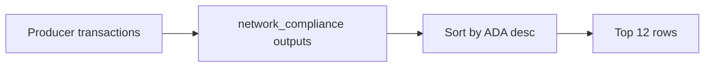

# Query 06 - Network Compliance ADA Producers

Runnable SPARQL: [`06-network-compliance-ada-producers.rq`](06-network-compliance-ada-producers.rq)

Back to the [May 2026 lattice demo](../../may-2026-amaru-lattice.md).

## Result

ADA quantities are decimal ADA. The query returns the largest 12 outputs
to network_compliance by ADA value.

| txId | ix | ada |
| --- | ---: | ---: |
| `64f27254f3c0311fb2e672cdb87de200089a596aa90dc09f8be4248540267cf0` | 0 | 1450000.000000 |
| `dfd355530e2d3baef6fc4cb22369c8b64aa117b0a84ff2cdaadc24cdc3fbc7bc` | 2 | 1449918.885741 |
| `10a5c1dafe7dd8d4ab680e35dc53b8b550da90bea55f2c758f36474064f2e598` | 2 | 1449833.102132 |
| `b5716ae98bb41b53c5fa2ebc6e8d5558879dc86d14fb998333e643095c6b233e` | 2 | 1410976.503281 |
| `26ef34aa02aecfb068e44f00e7d2f50deef377d168a7e33d1e7d01a11f32d46d` | 2 | 1372563.060767 |
| `f2791967f99ac04b33da17bd9c848b673c690a40d647b1e21e2651ff7a2f4657` | 2 | 1293332.892131 |
| `2695f20941ac832a9b36fdbe4f0b78a8f5bafddf964b353b81aec360a13df3f3` | 2 | 1215626.254430 |
| `b63aa2dd78c2a63b71aeba687cf45d445a98653a81f48774aa30236e47f30b86` | 2 | 1137012.611931 |
| `5fc04113da630ec676a5a7a66d82f53c0e64527ee592c3e6c5e1dccad67732ea` | 2 | 1058398.969432 |
| `5262be893119bd6d43c1c2fce5b0b89f7ac15f8e7d3d3dd66d0eb01e42b875d7` | 2 | 979785.326933 |
| `a38cb99bab8eb9922454fc7ae61ca38ff31b54d0db4afa6b33933763ba1cfd09` | 2 | 901171.684434 |
| `107e439f247fad6bd05543d81b9139547c521f50e5409120bed9f3d80b644055` | 2 | 822558.041935 |

## What

This query lists the largest ADA outputs produced at the
network_compliance address.

It is not a final-balance query. It is a producer-side inspection query:
which loaded transactions placed the largest ADA-bearing UTxOs at the
treasury address?

## Why

Large ADA movement is useful context when debugging the UTxO state. The
terminal ADA is only `129.217272`, but the graph shows much larger ADA
outputs being produced and then spent as the state rolls forward.

This query makes that churn visible.

## Diagram



## How

The query resolves the network_compliance bech32 address by label, finds
outputs at that address, converts base ADA units to decimal ADA, and
orders by ADA descending.

The `LIMIT 12` keeps the page readable while still exposing the largest
state-carrying outputs.

## SPARQL

```sparql
--8<-- "docs/may-2026-amaru-lattice/queries/06-network-compliance-ada-producers.rq"
```
