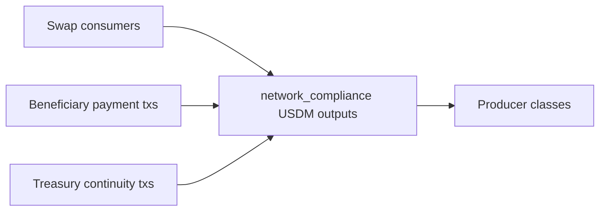

# Query 07 - Network Compliance USDM Output Classes

Runnable SPARQL: [`07-network-compliance-usdm-output-classes.rq`](07-network-compliance-usdm-output-classes.rq)

Back to the [May 2026 lattice demo](../../may-2026-amaru-lattice.md).

## Result

USDM quantities are decimal USDM.

| producerKind | txs | outputs | usdm |
| --- | ---: | ---: | ---: |
| treasury-continuity | 5 | 5 | 1133086.284353 |
| swap-receipt | 51 | 54 | 425131.618692 |
| beneficiary-payment-change | 2 | 2 | 3013.697480 |

## What

This query classifies USDM outputs produced at network_compliance by the
shape of the producing transaction.

`swap-receipt` means the producer consumes a SundaeSwap V3 order output
and returns USDM to the treasury. `beneficiary-payment-change` means the
producer also pays USDM to the CAG bridge and returns USDM change to the
treasury. `treasury-continuity` means the producer spends a previous
treasury UTxO and rolls treasury state forward.

## Why

This prevents the common mistake of treating every USDM output at the
treasury address as new income.

The only new incoming USDM in the May accounting is the `swap-receipt`
class: `425,131.618692` USDM. The `treasury-continuity` row is internal
turnover of treasury state, and the beneficiary-payment-change row is
the residual USDM returned by payment transactions.

## Diagram



## How

The query first builds one row per USDM output at the
network_compliance address.

It then applies three graph-shape tests to the producing transaction:
does it consume a SundaeSwap order output, does it emit USDM to the CAG
payee bridge, and does it spend a previous network_compliance output?

Those tests produce the `producerKind` classification.

## SPARQL

```sparql
--8<-- "docs/may-2026-amaru-lattice/queries/07-network-compliance-usdm-output-classes.rq"
```
