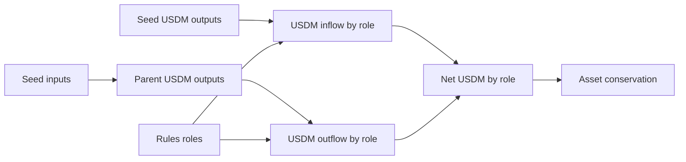

# Query 07 - USDM Role Flow

Runnable SPARQL: [`07-usdm-role-flow.rq`](07-usdm-role-flow.rq)

Back to the [May 2026 lattice demo](../../may-2026-amaru-lattice.md).

## What

This query computes USDM flow by ledger role. It reports USDM entering a
role through seed outputs, USDM leaving a role through closure-resolved
seed inputs, and the net delta per role.

It is the USDM equivalent of Query 03. The difference is that it follows
multi-asset values instead of lovelace, and it filters the asset list to
the full on-chain USDM asset id.

## Why

This query is where the "did we lose USDM?" framing gets corrected. A
negative net for one role means that role spent more USDM during the
seed set than it received back. It does not mean the asset disappeared.
The total must still conserve across roles, and Query 13 checks that at
the asset level.

Separating roles matters. USDM can move from network_compliance to the
CAG payee, to swap scripts, to pools, and back as change. If those
destinations are collapsed into one bucket, the result is easy to
misread. Role-level flow makes the route explicit.

## Diagram



## How

The query first pins the full on-chain USDM asset id:

```sparql
VALUES ?usdmAssetId {
  "c48cbb3d5e57ed56e276bc45f99ab39abe94e6cd7ac39fb402da47ad0014df105553444d"
}
```

The output branch scans seed outputs, walks the RDF list under
`cardano:hasAssetValue`, keeps only USDM entries, and counts those
quantities as `usdm_in` for the output role.

The input branch resolves seed inputs to parent outputs using the same
`(txid, index)` closure join used by the ADA queries. It walks the
parent output's asset list and counts USDM quantities as `usdm_out` for
the source role.

Roles are resolved from address labels first and credential labels
second. Unknown destinations remain visible as `wallet.other`.

The final net is:

```text
SUM(usdm_in) - SUM(usdm_out)
```

Across all rows, total USDM in and out should match. If they do not,
Query 13 should show a non-zero USDM conservation gap.

## SPARQL

```sparql
--8<-- "docs/may-2026-amaru-lattice/queries/07-usdm-role-flow.rq"
```

## Result

This table is the CSV result produced by Apache Jena over the May 2026
lattice. USDM quantities are decimal USDM.

| role | usdm_in | usdm_out | net_usdm |
|---|---|---|---|
| amaru-treasury.network_compliance | 1146156.659602 | 1554849.981833 | -408693.322231 |
| amaru.cag-payee | 418750.000000 | 0.000000 | 418750.000000 |
| sundae.swap.v3.order | 0.000000 | 7405.444311 | -7405.444311 |
| wallet.other | 490819.149109 | 493470.382567 | -2651.233458 |
