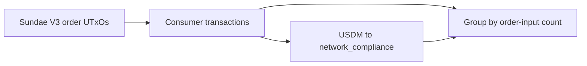

# Query 08 - Sundae Order Consumer Summary

Runnable SPARQL: [`08-sundae-order-consumer-summary.rq`](08-sundae-order-consumer-summary.rq)

Back to the [May 2026 lattice demo](../../may-2026-amaru-lattice.md).

## Result

ADA quantities are decimal ADA. USDM quantities are decimal USDM.

| orderInputs | txs | orderAda | receivedUsdm |
| ---: | ---: | ---: | ---: |
| 1 | 49 | 1616710.802883 | 415066.592562 |
| 2 | 1 | 85.783609 | 20.879498 |
| 3 | 1 | 38201.413508 | 10044.146632 |

```text
415,066.592562 + 20.879498 + 10,044.146632 = 425,131.618692 USDM
```

## What

This query summarizes the 51 SundaeSwap V3 order consumer transactions
that return USDM to the network_compliance treasury, grouped by how many
order UTxOs each consumer spends.

## Why

Query 19 lists every swap receipt. This query compresses that detail so
a reader can see whether the receipts are mostly one-order scoops or
multi-order scoops.

The result also cross-checks the incoming USDM total from Query 17:
the grouped `receivedUsdm` sum is exactly `425,131.618692`.

## Diagram



## How

The query has one subquery for consumed order inputs and one subquery for
USDM receipts.

The order-input subquery de-duplicates the Sundae V3 order script hash
from the repeated rules overlay, then counts consumed order references
per consumer transaction and sums their ADA.

The receipt subquery sums USDM outputs from the same producer
transaction back to network_compliance. Joining after those per-tx
aggregations avoids multiplying USDM receipts by the number of order
inputs.

## SPARQL

```sparql
--8<-- "docs/may-2026-amaru-lattice/queries/08-sundae-order-consumer-summary.rq"
```
