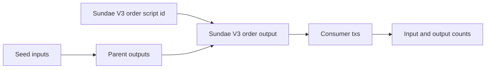

# Query 08 - Sundae V3 Order Consumers

Runnable SPARQL: [`08-sundae-v3-order-consumers.rq`](08-sundae-v3-order-consumers.rq)

Back to the [May 2026 lattice demo](../../may-2026-amaru-lattice.md).


## Result

This table is the CSV result produced by Apache Jena over the May 2026
lattice.

| seedTxId | orderInputsConsumed | outputCount | nonOrderOutputCount |
| --- | ---: | ---: | ---: |
| 4e2642080c8d171aad05baed11b076de498b76acecc1c2412660048fae8aefa3 | 9 | 11 | 11 |
| a8bab7bfe1e2ed9d3a5b40189c8de51c5974a6e05c71fc1000a6abd57500b365 | 1 | 2 | 2 |

## What

This query finds seed transactions that consume UTxOs controlled by the
`sundae.swap.v3.order` script. It reports the seed transaction id, how
many Sundae V3 order inputs it consumed, how many outputs it created,
and how many of those outputs are not order-script outputs.

The query is deliberately named "consumer" rather than "scoop". A batch
scoop and a swap cancel can both consume Sundae V3 order UTxOs; this
query finds the structural pattern first and leaves interpretation to
later review.

## Why

The demo needs to prove that the graph can identify the 9-order scoop
without decoding every swap-order datum. Consumption of script UTxOs is
already enough to identify transactions that interacted with the order
script. PR 103 corrected that script's identity: it is SundaeSwap V3's
`order.spend` validator, not an Amaru-authored `swap.v2` contract.

This is also a guard against overclaiming. A transaction that consumes
one order UTxO might be a cancel or a small settlement, not necessarily
the multi-order scoop the operator wants to inspect. The
`orderInputsConsumed` count gives the first ranking signal.

## Diagram



## How

The inner query resolves the Sundae V3 order payment credential from
`rules.yaml`:

```sparql
?orderScript rdfs:label "sundae.swap.v3.order" ;
             cardano:hasIdentifier/cardano:bytesHex ?orderScriptHash .
```

It then walks every seed input to its parent output. If the parent
output address has a payment credential whose identifier is the order
script hash, the seed transaction consumed a Sundae V3 order UTxO.

The outer query counts all outputs created by that seed transaction and
uses a `FILTER NOT EXISTS` block to count outputs whose address is not
controlled by the same order-script payment credential. That helps separate
transactions that merely roll script state forward from transactions
that produce settlement outputs to other roles.

## SPARQL

```sparql
--8<-- "docs/may-2026-amaru-lattice/queries/08-sundae-v3-order-consumers.rq"
```
