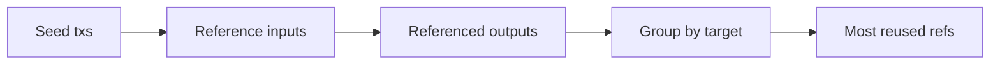

# Query 09 - Reference-Input Reuse

Runnable SPARQL: [`09-reference-input-reuse.rq`](09-reference-input-reuse.rq)

Back to the [May 2026 lattice demo](../../may-2026-amaru-lattice.md).

## What

This query lists the most reused reference inputs in the May seed set.
For each referenced `(parent txid, output index)`, it counts how many
distinct seed transactions used that output as a reference input.

It is a script and infrastructure usage view, not a value-flow view.
Reference inputs are read-only; they do not spend the referenced UTxO.

## Why

Treasury and swap transactions often rely on published reference scripts
or shared data UTxOs. A small number of hot reference inputs should
appear across many transactions. Seeing that reuse proves the graph
captures CIP-31 reference-input edges and can expose shared
infrastructure dependencies.

This also helps explain transaction size and fee patterns. Transactions
with multiple reference inputs and script interactions tend to be more
expensive than simple wallet payments.

## Diagram



## How

The query scans seed transactions with `cardano:hasReferenceInput`. It
follows each reference input to `cardano:fromTxOutRef`, then reads the
referenced transaction id and output index:

```sparql
?refTxOutRef cardano:hasTxId/cardano:bytesHex ?parentTxId ;
             cardano:hasIndex ?ix .
```

It groups by `(parentTxId, ix)` and counts distinct seed transactions
using each reference. The `LIMIT 5` keeps the result focused on the
hot entries that explain most of the month's reference-script reuse.

If this query returned no rows for a script-heavy month, that would
suggest the graph failed to emit reference inputs or the seed set does
not include the expected script transactions.

## SPARQL

```sparql
PREFIX cardano: <https://lambdasistemi.github.io/cardano-knowledge-maps/vocab/cardano#>

SELECT ?parentTxId ?ix (COUNT(DISTINCT ?seed) AS ?usingSeedTxs)
WHERE {
  ?seed cardano:hasLatticeRole "seed" ;
        cardano:hasReferenceInput ?ref .
  ?ref cardano:fromTxOutRef ?refTxOutRef .
  ?refTxOutRef cardano:hasTxId/cardano:bytesHex ?parentTxId ;
               cardano:hasIndex ?ix .
}
GROUP BY ?parentTxId ?ix
ORDER BY DESC(?usingSeedTxs) ?parentTxId ?ix
LIMIT 5

```

## Result

This table is the CSV result produced by Apache Jena over the May 2026 lattice. ADA quantities are lovelace; USDM quantities are base units.

| parentTxId | ix | usingSeedTxs |
|---|---|---|
| 11ace24a7b0caad4a68a38ef2fff18185dc9ea604e84425dab487cae94e4cf54 | 0 | 28 |
| 25ba96f5deb14bb5c56e7542d6a9ba8450f52cc698ebd74574e1a0525d861095 | 2 | 27 |
| 810bfcbde85ae72f27d7e8cd154c03c802de15d3fa0dd83a32a4b0fdba330b3c | 0 | 27 |
| e7b395a93d49a17994d66df0e4778a01dee05e7711e6612f28d97b63e4e6311c | 2 | 27 |
| f5f1bdfad3eb4d67d2fc36f36f47fc2938cf6f001689184ab320735a28642cf2 | 0 | 2 |
