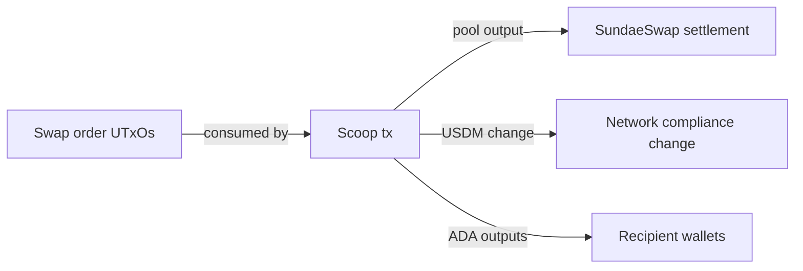

# Query 10 - Scoop Output Candidates

Runnable SPARQL: [`10-scoop-output-candidates.rq`](10-scoop-output-candidates.rq)

Back to the [May 2026 lattice demo](../../may-2026-amaru-lattice.md).

## What

This query lists output candidates from the known 9-order swap.v2
consumer transaction. For each non-swap output, it reports the output
role, address, lovelace, and USDM amount.

It answers "what did the scoop transaction create?" It does not claim to
match each individual swap order to a final intended recipient. That
stronger claim requires either a correct live swap-order datum decode or
additional off-chain order context.

## Why

The current swap.v2 blueprint in the repository does not match the live
mainnet 6-field swap-order datum, so the graph cannot yet read the
recipient directly from each order datum. This query demonstrates the
available workaround: follow the consumption edge to the transaction
that settled the orders, then inspect its non-swap outputs.

This is still useful for correctness. It shows the pool settlement,
network_compliance change, and wallet outputs that the graph can derive
without manual transaction viewing.

## Diagram



## How

The query pins the seed transaction id with a `VALUES` block:

```sparql
VALUES ?scoopTxId {
  "4e2642080c8d171aad05baed11b076de498b76acecc1c2412660048fae8aefa3"
}
```

It proves that this transaction consumed at least one swap.v2 UTxO by
joining each input to its parent output and checking the parent output's
payment credential against the `amaru.swap.v2` identifier.

After identifying the transaction, the query scans all of its outputs,
filters out outputs controlled by the swap.v2 payment credential, and
reads lovelace plus optional USDM. It joins output bech32 addresses back
to `rules.yaml` labels where available, otherwise it labels them as
`wallet-output`.

The result is a candidate set. It is intentionally honest about the
remaining limitation: output inspection is not the same as per-order
recipient proof.
