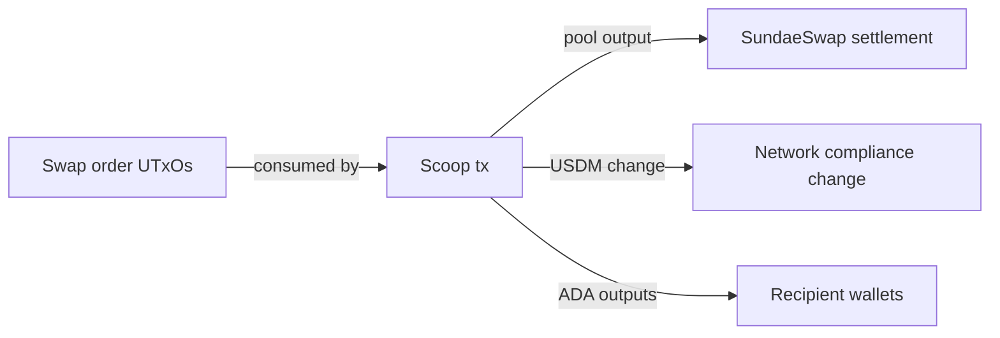

# Query 10 - Sundae V3 Scoop Output Candidates

Runnable SPARQL: [`10-sundae-v3-scoop-output-candidates.rq`](10-sundae-v3-scoop-output-candidates.rq)

Back to the [May 2026 lattice demo](../../may-2026-amaru-lattice.md).

## What

This query lists output candidates from the known 9-order Sundae V3
order consumer transaction. For each non-order-script output, it
reports the output role, address, lovelace, and USDM amount.

It answers "what did the scoop transaction create?" It does not claim to
match each individual swap order to a final intended recipient. That
stronger claim requires either a correct live swap-order datum decode or
additional off-chain order context.

## Why

PR 103 corrected the script identity and shipped the SundaeSwap V3
blueprint, but that upstream blueprint intentionally types the order
datum as opaque `Data`. The graph still cannot read the recipient
directly from each order datum. This query demonstrates the available
workaround: follow the consumption edge to the transaction that settled
the orders, then inspect its non-order outputs.

This is still useful for correctness. It shows the pool settlement,
network_compliance change, and wallet outputs that the graph can derive
without manual transaction viewing.

## Diagram



## How

The query pins the seed transaction id with a `VALUES` block:

```sparql
VALUES ?scoopTxId {
  "4e2642080c8d171aad05baed11b076de498b76acecc1c2412660048fae8aefa3"
}
```

It proves that this transaction consumed at least one Sundae V3 order UTxO by
joining each input to its parent output and checking the parent output's
payment credential against the `sundae.swap.v3.order` identifier.

After identifying the transaction, the query scans all of its outputs,
filters out outputs controlled by the order-script payment credential, and
reads lovelace plus optional USDM. It joins output bech32 addresses back
to `rules.yaml` labels where available, otherwise it labels them as
`wallet-output`.

The result is a candidate set. It is intentionally honest about the
remaining limitation: output inspection is not the same as per-order
recipient proof.

## SPARQL

```sparql
--8<-- "docs/may-2026-amaru-lattice/queries/10-sundae-v3-scoop-output-candidates.rq"
```

## Result

This table is the CSV result produced by Apache Jena over the May 2026
lattice. ADA quantities are decimal ADA; USDM quantities are decimal USDM.

| scoopTxId | outputRole | outputBech32 | outputAda | outputUsdm |
|---|---|---|---|---|
| 4e2642080c8d171aad05baed11b076de498b76acecc1c2412660048fae8aefa3 | wallet-output | addr1z8srqftqemf0mjlukfszd97ljuxdp44r372txfcr75wrz2auzrlrz2kdd83wzt9u9n9qt2swgvhrmmn96k55nq6yuj4qw992w9 | 1833033.390929 | 490819.149109 |
| 4e2642080c8d171aad05baed11b076de498b76acecc1c2412660048fae8aefa3 | amaru-treasury.network_compliance | addr1xyezq8wpaqnssdjvd3p220uf7e6nzjae44w6yu625y965rfjyqwur6p8pqmycmzz55lcnan4x99mnt2a5fe54ggt4gxs8thzgk | 2.544001 | 10056.677769 |
| 4e2642080c8d171aad05baed11b076de498b76acecc1c2412660048fae8aefa3 | wallet-output | addr1q93k6rgprz5fxwkpvl2vgjq4pwejth400f8aldz2m3lj7khrnd05p259l0qjrf396am6wahv5895ey35y62fexta3q5q3cc3k8 | 5374.667017 | 0.000000 |
| 4e2642080c8d171aad05baed11b076de498b76acecc1c2412660048fae8aefa3 | wallet-output | addr1qyh6anc5fl20kj9h39ud20ktcfu4ky4jy6tu3caeh2kpn6v9kyn9lnp9jl94yk45uemyfdhwrlapzcwkydlvkyx2zqmqs6s9q6 | 5054.620800 | 0.000000 |
| 4e2642080c8d171aad05baed11b076de498b76acecc1c2412660048fae8aefa3 | wallet-output | addr1q97zqkf4mdr7xf60mrulm85vlprtz2gl4mmyxr5n880px3utfc5sq9nm7j8f3qpmkrkse47z76mfngy8zm522g94qlusvydjul | 4081.058504 | 0.000000 |
| 4e2642080c8d171aad05baed11b076de498b76acecc1c2412660048fae8aefa3 | wallet-output | addr1q9v792aplv9tccd7u86lnfmj695pk6wunvuu2zp3l5h6sr4r5kadmc4lxv4wn7xqay7s28vkdq7agf075wfq3gws8apqagpnxm | 3801.196047 | 0.000000 |
| 4e2642080c8d171aad05baed11b076de498b76acecc1c2412660048fae8aefa3 | wallet-output | addr1q9v792aplv9tccd7u86lnfmj695pk6wunvuu2zp3l5h6sr4r5kadmc4lxv4wn7xqay7s28vkdq7agf075wfq3gws8apqagpnxm | 3785.625907 | 0.000000 |
| 4e2642080c8d171aad05baed11b076de498b76acecc1c2412660048fae8aefa3 | wallet-output | addr1q9v792aplv9tccd7u86lnfmj695pk6wunvuu2zp3l5h6sr4r5kadmc4lxv4wn7xqay7s28vkdq7agf075wfq3gws8apqagpnxm | 3770.151396 | 0.000000 |
| 4e2642080c8d171aad05baed11b076de498b76acecc1c2412660048fae8aefa3 | wallet-output | addr1v998zy8jct9p6p73ctf74dnyawprsdmzcjtwekmr8s9amyqsnm5pq | 3150.983800 | 0.000000 |
| 4e2642080c8d171aad05baed11b076de498b76acecc1c2412660048fae8aefa3 | wallet-output | addr1qy4xf86yh5pmr5z6ey6wfpg34mhr3q9txchhx6kwvtex5q6kvt8uaut5ygpykmywnq3r39u8gtdw6cj8u5352dyjlhxqx5y7py | 1020.278540 | 0.000000 |
| 4e2642080c8d171aad05baed11b076de498b76acecc1c2412660048fae8aefa3 | wallet-output | addr1qy4xf86yh5pmr5z6ey6wfpg34mhr3q9txchhx6kwvtex5q6kvt8uaut5ygpykmywnq3r39u8gtdw6cj8u5352dyjlhxqx5y7py | 1019.894682 | 0.000000 |
