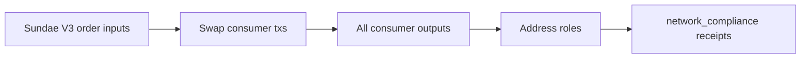

# Query 10 - Swap Consumer Output Roles

Runnable SPARQL: [`10-swap-consumer-output-roles.rq`](10-swap-consumer-output-roles.rq)

Back to the [May 2026 lattice demo](../../may-2026-amaru-lattice.md).

## Result

ADA quantities are decimal ADA. USDM quantities are decimal USDM.

| outputRole | outputs | ada | usdm |
| --- | ---: | ---: | ---: |
| wallet.other | 249 | 96254260.243609 | 24525287.591011 |
| amaru-treasury.network_compliance | 55 | 52949.457333 | 425131.618692 |
| amaru.network-operator | 1 | 19.755739 | 0.000000 |

## What

This query looks at all outputs produced by the 51 SundaeSwap V3 order
consumer transactions and groups those outputs by resolved address role.

It is wider than Query 19. Query 19 only looks at USDM returned to
network_compliance; this query shows what else those same swap-consumer
transactions emitted.

## Why

The key line is `amaru-treasury.network_compliance`: 55 outputs carrying
`425,131.618692` USDM. That agrees with Query 17 and Query 19.

The `wallet.other` row is not treasury income. It is the rest of the
swap-consumer output surface, grouped as unlabeled wallet/script
addresses because those addresses are not declared in `rules.yaml`.

## Diagram



## How

The query first identifies swap consumers by proving that they consume
outputs at the SundaeSwap V3 order script hash.

It then emits one row per produced output, resolves the output address
role from the rules overlay when available, samples one role per output
to avoid repeated overlay facts, and finally groups by role.

USDM is matched by the full asset id, not by ticker.

## SPARQL

```sparql
--8<-- "docs/may-2026-amaru-lattice/queries/10-swap-consumer-output-roles.rq"
```
