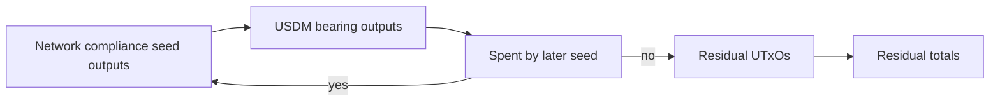

# Query 11 - Network Compliance USDM Residual

Runnable SPARQL: [`11-network-compliance-usdm-residual.rq`](11-network-compliance-usdm-residual.rq)

Back to the [May 2026 lattice demo](../../may-2026-amaru-lattice.md).

## What

This query computes the end-of-seed-set USDM residual at the
network_compliance treasury address. It counts seed outputs at
network_compliance that carry USDM and are not spent by another seed
transaction in the same loaded lattice.

It reports the number of residual UTxOs, residual lovelace, and residual
USDM on those unspent-by-seed outputs.

## Why

This is the seed-set version of the "we still have USDM left" question.
A flow query can show that network_compliance had a negative net USDM
delta during the May transaction set. That does not mean the ending
balance is zero and it does not mean the delta is a loss.

The residual query switches from flow accounting to state accounting. It
asks which network_compliance outputs remain terminal with respect to
the loaded seed set. That is the right shape for discussing "left at the
end of the seed set" rather than "moved during the interval."

This is not the current live treasury state. The current-state proof is
Query 14 plus the Query 15/16 live checks, which run over the extended
address-history graph and produce 6,381,618,692 USDM base units.

## Diagram



## How

The query resolves the network_compliance bech32 address from
`rules.yaml` and pins the full on-chain USDM asset id in a `VALUES`
block. It then scans seed outputs at that address that contain USDM.

For each candidate output, it checks whether another seed transaction
spends the same `(txid, index)`:

```sparql
FILTER NOT EXISTS {
  ?laterSeed cardano:hasLatticeRole "seed" ;
             cardano:hasInput ?input .
  ?input cardano:fromTxOutRef ?ref .
  ?ref cardano:hasTxId/cardano:bytesHex ?txId ;
       cardano:hasIndex ?ix .
}
```

If no later seed consumes the output, it is terminal for this seed set.
The query then aggregates those terminal outputs.

This is still bounded by graph completeness. If a later transaction
outside the seed set spent the output, Query 14 or the live-diff queries
are needed to compare the graph-derived terminal state with a live node
boundary.

## SPARQL

```sparql
PREFIX cardano: <https://lambdasistemi.github.io/cardano-knowledge-maps/vocab/cardano#>
PREFIX rdf:     <http://www.w3.org/1999/02/22-rdf-syntax-ns#>
PREFIX rdfs:    <http://www.w3.org/2000/01/rdf-schema#>

# End-of-slice residual USDM at the network_compliance treasury address.
# This is a balance-style query over the May seed set: it counts seed
# outputs at network_compliance that are not consumed by another seed
# transaction in the same lattice.
SELECT (COUNT(DISTINCT ?out) AS ?utxoCount)
       (SUM(?lovelace) AS ?residualLovelace)
       (SUM(?usdm) AS ?residualUsdm)
WHERE {
  ?networkCompliance rdfs:label "amaru-treasury.network_compliance" ;
                     cardano:bech32 ?networkComplianceBech32 .
  VALUES ?usdmAssetId {
    "c48cbb3d5e57ed56e276bc45f99ab39abe94e6cd7ac39fb402da47ad0014df105553444d"
  }

  ?seed cardano:hasLatticeRole "seed" ;
        cardano:hasTxId/cardano:bytesHex ?txId ;
        cardano:hasOutput ?out .
  ?out cardano:hasIndex ?ix ;
       cardano:atAddress/cardano:bech32 ?networkComplianceBech32 ;
       cardano:lovelace ?lovelace ;
       cardano:hasAssetValue/rdf:rest*/rdf:first ?asset .
  ?asset cardano:hasIdentifier/cardano:bytesHex ?usdmAssetId ;
         cardano:quantity ?usdm .

  FILTER NOT EXISTS {
    ?laterSeed cardano:hasLatticeRole "seed" ;
               cardano:hasInput ?input .
    ?input cardano:fromTxOutRef ?ref .
    ?ref cardano:hasTxId/cardano:bytesHex ?txId ;
         cardano:hasIndex ?ix .
  }
}

```

## Result

This table is the CSV result produced by Apache Jena over the 30-seed
May lattice. ADA quantities are lovelace; USDM quantities are base
units. It is an end-of-seed-set residual, not the live final balance.

| utxoCount | residualLovelace | residualUsdm |
|---|---|---|
| 1 | 120299272 | 1349523953 |
