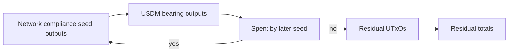

# Query 11 - Network Compliance USDM Residual

Runnable SPARQL: [`11-network-compliance-usdm-residual.rq`](11-network-compliance-usdm-residual.rq)

Back to the [May 2026 lattice demo](../../may-2026-amaru-lattice.md).

## What

This query computes the end-of-seed-set USDM residual at the
network_compliance treasury address. It counts seed outputs at
network_compliance that carry USDM and are not spent by another seed
transaction in the same loaded lattice.

It reports the number of residual UTxOs, residual lovelace, and residual
USDM on those unspent-by-seed outputs.

## Why

This is the query for the "we still have USDM left" question. A flow
query can show that network_compliance had a negative net USDM delta
during the May transaction set. That does not mean the ending balance is
zero and it does not mean the delta is a loss.

The residual query switches from flow accounting to state accounting. It
asks which network_compliance outputs remain terminal with respect to
the loaded seed set. That is the right shape for discussing "left at the
end" rather than "moved during the interval."

## Diagram



## How

The query resolves the network_compliance bech32 address and the USDM
asset id from `rules.yaml`. It then scans seed outputs at that address
that contain USDM.

For each candidate output, it checks whether another seed transaction
spends the same `(txid, index)`:

```sparql
FILTER NOT EXISTS {
  ?laterSeed cardano:hasLatticeRole "seed" ;
             cardano:hasInput ?input .
  ?input cardano:fromTxOutRef ?ref .
  ?ref cardano:hasTxId/cardano:bytesHex ?txId ;
       cardano:hasIndex ?ix .
}
```

If no later seed consumes the output, it is terminal for this seed set.
The query then aggregates those terminal outputs.

This is still bounded by graph completeness. If a later transaction
outside the seed set spent the output, Query 14 or the live-diff queries
are needed to compare the graph-derived terminal state with a live node
boundary.
