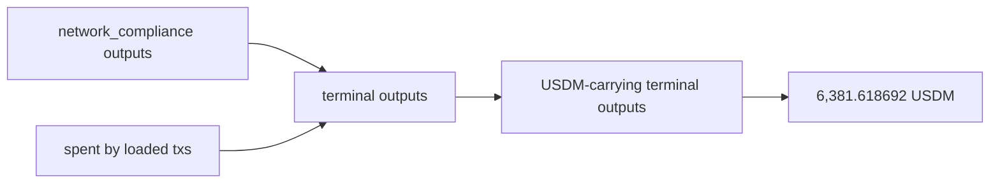

# Query 11 - Terminal USDM Summary

Runnable SPARQL: [`11-terminal-usdm-summary.rq`](11-terminal-usdm-summary.rq)

## Result

ADA quantities are decimal ADA. USDM quantities are decimal USDM.

| usdmTerminalUtxos | ada | usdm |
| ---: | ---: | ---: |
| 4 | 127.217272 | 6381.618692 |

## What

This query is the compact terminal-USDM balance for the
network_compliance address.

It counts only terminal UTxOs that carry USDM. Query 14 shows all five
terminal UTxOs, including the one with no USDM.

## Why

The user's concrete balance question is the `6,381.618692` USDM
remainder. This query isolates just that remainder and the ADA sitting
with it.

It is a smaller companion to Query 16, which compares graph terminal
state to the live snapshot.

## Diagram



## How

The query resolves network_compliance by label, selects outputs at that
address, and filters out any output whose `(txid, index)` is consumed by
another loaded transaction.

It then keeps terminal outputs with the USDM asset id and sums their ADA
and USDM quantities.

## SPARQL

```sparql
--8<-- "docs/may-2026-amaru-lattice/queries/11-terminal-usdm-summary.rq"
```
