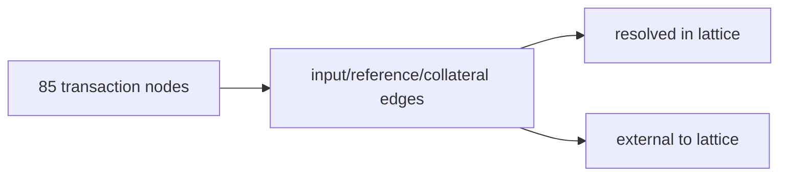

# Query 12 - Lattice Input Coverage

Runnable SPARQL: [`12-lattice-input-coverage.rq`](12-lattice-input-coverage.rq)

Back to the [May 2026 lattice demo](../../may-2026-amaru-lattice.md).

## Result

| edgeKind | coverage | edges |
| --- | --- | ---: |
| collateral | external-to-lattice | 54 |
| collateral | resolved-in-lattice | 31 |
| reference | external-to-lattice | 284 |
| spending | external-to-lattice | 245 |
| spending | resolved-in-lattice | 177 |

## What

This query states which input references resolve to outputs inside the
85-transaction lattice and which references point outside it.

It covers spending inputs, reference inputs, and collateral inputs.

## Why

The 85-tx report is not a generic ancestry closure to genesis. It is a
network_compliance state proof over the selected transaction set.

This query makes that boundary explicit. Some spending and collateral
references resolve inside the lattice because the parent output is part
of the selected network_compliance history. Other inputs and all
reference inputs can point outside the selected set without breaking the
treasury final-state proof.

## Diagram



## How

The query unions the three edge predicates:
`cardano:hasInput`, `cardano:hasReferenceInput`, and
`cardano:hasCollateralInput`.

For each edge it extracts the referenced `(txid, index)` and asks
whether the loaded graph contains a transaction with that id and an
output at that index. The answer becomes `resolved-in-lattice` or
`external-to-lattice`.

## SPARQL

```sparql
--8<-- "docs/may-2026-amaru-lattice/queries/12-lattice-input-coverage.rq"
```
