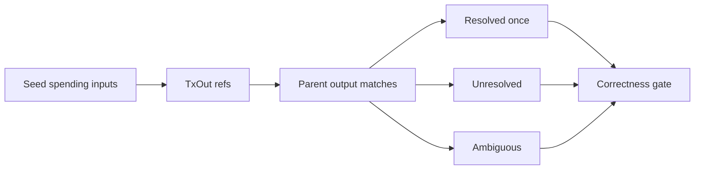

# Query 12 - Seed Input Resolution Cardinality

Runnable SPARQL: [`12-seed-input-resolution-cardinality.rq`](12-seed-input-resolution-cardinality.rq)

Back to the [May 2026 lattice demo](../../may-2026-amaru-lattice.md).

## What

This query checks whether every spending input of every seed transaction
resolves to exactly one parent output in the loaded graph.

It returns four counts: total seed spending inputs, inputs resolved once,
inputs unresolved, and inputs resolved ambiguously.

## Why

This is a graph-correctness proof gate. The whole lattice model depends
on the ability to follow an input reference to the exact output it
spends. If an input is unresolved, the closure is missing a producer
transaction. If an input is ambiguous, the graph does not uniquely
identify outputs by `(txid, index)`.

Without this proof, flow queries can silently undercount inputs or
double-count source values. That would make conservation and role-flow
claims unreliable.

## Diagram



## How

For each seed input, the query reads:

```sparql
?ref cardano:hasTxId/cardano:bytesHex ?parentTxId ;
     cardano:hasIndex ?ix .
```

It then optionally joins to a parent transaction with the same txid and
an output with the same index. The inner query counts distinct matching
parent outputs for each input.

The outer query converts those per-input match counts into categories:

```text
matches = 1  -> resolved once
matches = 0  -> unresolved
matches > 1  -> ambiguous
```

The expected result for a complete depth-1 closure is:

```text
seedSpendingInputs = resolvedOnceInputs
unresolvedInputs = 0
ambiguousInputs = 0
```

If this query fails, fix closure construction or output identity before
interpreting any value-flow query.
