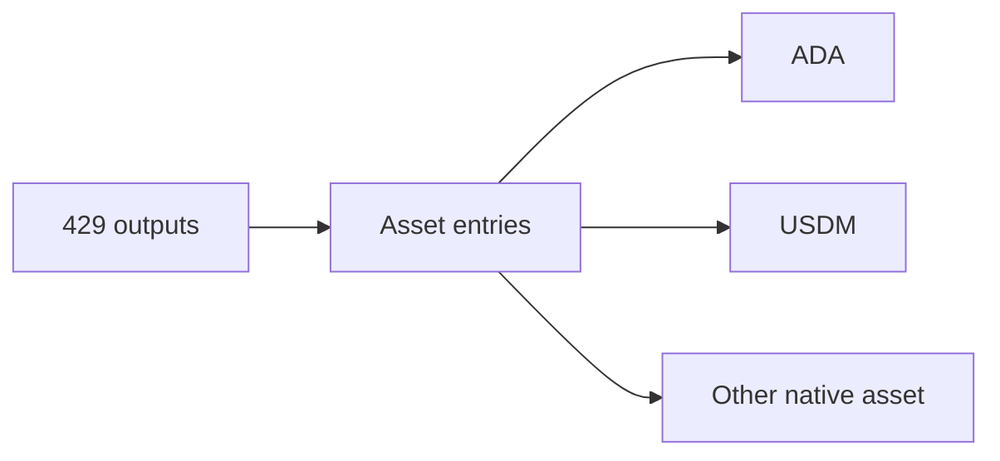

# Query 13 - Lattice Output Assets

Runnable SPARQL: [`13-lattice-output-assets.rq`](13-lattice-output-assets.rq)

Back to the [May 2026 lattice demo](../../may-2026-amaru-lattice.md).

## Result

ADA and USDM quantities are decimal units. The long hex row is another
native asset id and is shown in raw units.

| assetId | outputEntries | totalQuantity |
| --- | ---: | ---: |
| ada | 429 | 118438513.316450 |
| `e0302560ced2fdcbfcb2602697df970cd0d6a38f94b32703f51c312b000de14064f35d26b237ad58e099041bc14c687ea7fdc58969d7d5b66e2540ef` | 51 | 51 |
| usdm | 116 | 26505269.191536 |

## What

This query lists the asset classes present in outputs emitted by the
85-transaction lattice.

It is a gross output-surface query. It does not compute final balances
and it does not net spent outputs away.

## Why

Before interpreting token-specific accounting, it helps to know the
asset universe in the emitted outputs. In this graph, output entries
contain ADA, USDM, and one additional native asset class.

The gross USDM total is much larger than the final treasury remainder
because the same value can move through multiple outputs as transactions
roll state forward.

## Diagram



## How

The query unions ADA output amounts with native asset entries from
`cardano:hasAssetValue`.

Native assets are restricted to identifiers whose leaf type is
`AssetClass`. That keeps typed datum or redeemer byte fields out of the
asset table. The USDM asset id is displayed as `usdm`; other native
assets keep their raw asset id.

## SPARQL

```sparql
--8<-- "docs/may-2026-amaru-lattice/queries/13-lattice-output-assets.rq"
```
