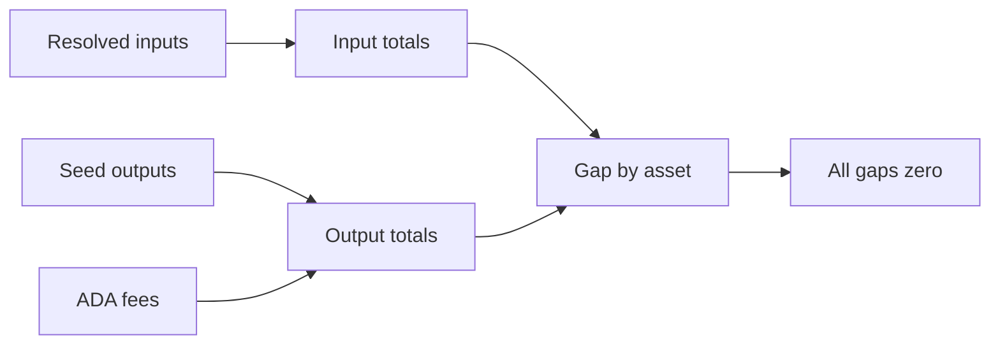

# Query 13 - Seed Value Conservation By Asset

Runnable SPARQL: [`13-seed-value-conservation-by-asset.rq`](13-seed-value-conservation-by-asset.rq)

Back to the [May 2026 lattice demo](../../may-2026-amaru-lattice.md).

## What

This query checks value conservation for every observed asset across the
seed transaction set. It reports total input quantity, total output
quantity, and the gap per asset id.

For lovelace, fees are counted on the output side because fees leave the
transaction's UTxO outputs but are still part of ledger accounting. For
native assets such as USDM, the query compares resolved input asset
quantities with seed output asset quantities.

## Why

Query 00 proves ADA conservation. This query generalizes the same idea
to all assets observed in the seed inputs and outputs. It is the proof
that USDM did not vanish from the graph.

This matters because a role can have a negative net flow while the asset
still conserves globally. Network_compliance can spend USDM to CAG payee
or swap-related destinations, and the total USDM can still balance
exactly across the seed set.

## Diagram



## How

The query is a union of five accounting branches:

1. Lovelace from resolved seed inputs.
2. Lovelace from seed outputs.
3. Lovelace fees from seed transactions.
4. Native assets from resolved seed inputs.
5. Native assets from seed outputs.

Each branch emits rows with a common shape:

```text
assetId, inputQty, outputQty
```

Input branches bind `outputQty` to zero. Output and fee branches bind
`inputQty` to zero. After the union, the query groups by `assetId` and
computes:

```text
SUM(inputQty) - SUM(outputQty)
```

For a no-mint/no-burn transaction set, every asset gap should be zero.
If a non-zero gap appears, either the graph is missing an input/output
edge, the closure did not resolve a parent output, or the transaction
set includes mint/burn semantics that need to be modeled explicitly.

## SPARQL

```sparql
PREFIX cardano: <https://lambdasistemi.github.io/cardano-knowledge-maps/vocab/cardano#>
PREFIX rdf:     <http://www.w3.org/1999/02/22-rdf-syntax-ns#>

# Proof gate: for the seed transactions, every observed asset balances
# exactly across resolved spending inputs and outputs. Lovelace includes
# fees on the output side.
#
# A non-zero gap means either the graph is missing an input/output edge,
# a parent output did not resolve, or mint/burn semantics need to be
# included for this transaction set.
SELECT ?assetId
       (SUM(?inputQty) AS ?totalInputQty)
       (SUM(?outputQty) AS ?totalOutputQty)
       ((SUM(?inputQty) - SUM(?outputQty)) AS ?gap)
WHERE {
  {
    ?seed cardano:hasLatticeRole "seed" ;
          cardano:hasInput ?input .
    ?input cardano:fromTxOutRef ?ref .
    ?ref cardano:hasTxId/cardano:bytesHex ?parentTxId ;
         cardano:hasIndex ?ix .
    ?parent cardano:hasTxId/cardano:bytesHex ?parentTxId ;
            cardano:hasOutput ?parentOut .
    ?parentOut cardano:hasIndex ?ix ;
               cardano:lovelace ?inputQty .
    BIND ("lovelace" AS ?assetId)
    BIND (0 AS ?outputQty)
  }
  UNION
  {
    ?seed cardano:hasLatticeRole "seed" ;
          cardano:hasOutput/cardano:lovelace ?outputQty .
    BIND ("lovelace" AS ?assetId)
    BIND (0 AS ?inputQty)
  }
  UNION
  {
    ?seed cardano:hasLatticeRole "seed" ;
          cardano:hasFee ?outputQty .
    BIND ("lovelace" AS ?assetId)
    BIND (0 AS ?inputQty)
  }
  UNION
  {
    ?seed cardano:hasLatticeRole "seed" ;
          cardano:hasInput ?input .
    ?input cardano:fromTxOutRef ?ref .
    ?ref cardano:hasTxId/cardano:bytesHex ?parentTxId ;
         cardano:hasIndex ?ix .
    ?parent cardano:hasTxId/cardano:bytesHex ?parentTxId ;
            cardano:hasOutput ?parentOut .
    ?parentOut cardano:hasIndex ?ix ;
               cardano:hasAssetValue/rdf:rest*/rdf:first ?asset .
    ?asset cardano:hasIdentifier/cardano:bytesHex ?assetId ;
           cardano:quantity ?inputQty .
    BIND (0 AS ?outputQty)
  }
  UNION
  {
    ?seed cardano:hasLatticeRole "seed" ;
          cardano:hasOutput ?out .
    ?out cardano:hasAssetValue/rdf:rest*/rdf:first ?asset .
    ?asset cardano:hasIdentifier/cardano:bytesHex ?assetId ;
           cardano:quantity ?outputQty .
    BIND (0 AS ?inputQty)
  }
}
GROUP BY ?assetId
ORDER BY ?assetId

```

## Result

This table is the CSV result produced by Apache Jena over the May 2026 lattice. ADA quantities are lovelace; USDM quantities are base units.

| assetId | totalInputQty | totalOutputQty | gap |
|---|---|---|---|
| c48cbb3d5e57ed56e276bc45f99ab39abe94e6cd7ac39fb402da47ad0014df105553444d | 2055725808711 | 2055725808711 | 0 |
| e0302560ced2fdcbfcb2602697df970cd0d6a38f94b32703f51c312b000de14064f35d26b237ad58e099041bc14c687ea7fdc58969d7d5b66e2540ef | 1 | 1 | 0 |
| lovelace | 22186097902390 | 22186097902390 | 0 |
