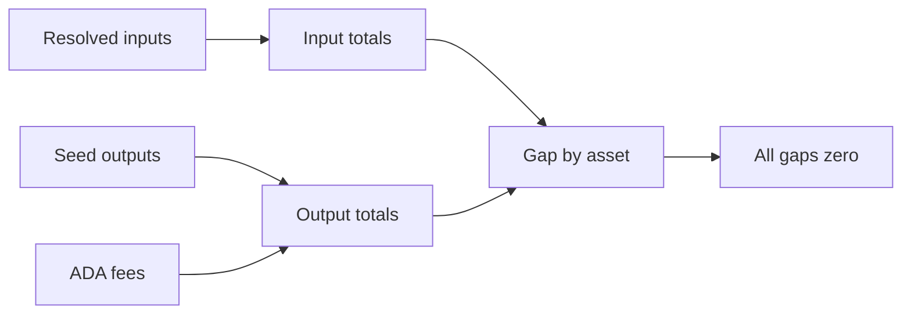

# Query 13 - Seed Value Conservation By Asset

Runnable SPARQL: [`13-seed-value-conservation-by-asset.rq`](13-seed-value-conservation-by-asset.rq)

Back to the [May 2026 lattice demo](../../may-2026-amaru-lattice.md).


## Result

This table is the CSV result produced by Apache Jena over the May 2026
lattice. ADA and USDM quantities are decimal units.

| assetId | totalInputQty | totalOutputQty | gap |
| --- | ---: | ---: | ---: |
| ada | 18129097.902390 | 22186097.902390 | -4057000.000000 |
| e0302560ced2fdcbfcb2602697df970cd0d6a38f94b32703f51c312b000de14064f35d26b237ad58e099041bc14c687ea7fdc58969d7d5b66e2540ef | 1 | 1 | 0 |
| usdm | 2055725.808711 | 2055725.808711 | 0.000000 |

The USDM and NFT rows conserve. The ADA row does not: it has the same
`4,057,000 ADA` missing-input gap reported by Query 00 and explained by
Query 12.

## What

This query checks value conservation for every observed asset across the
seed transaction set. It reports total input quantity, total output
quantity, and the gap per asset id.

For lovelace, fees are counted on the output side because fees leave the
transaction's UTxO outputs but are still part of ledger accounting. For
native assets such as USDM, the query compares resolved input asset
quantities with seed output asset quantities.

## Why

Query 00 is the ADA conservation gate. This query generalizes the same
idea to all assets observed in the seed inputs and outputs. In the
current graph, ADA is not proof-complete because one seed input is
unresolved; USDM still balances exactly.

This matters because a role can have a negative net flow while the asset
still conserves globally. Network_compliance can spend USDM to CAG payee
or swap-related destinations, and the total USDM can still balance
exactly across the seed set.

## Diagram



## How

The query is a union of five accounting branches:

1. Lovelace from resolved seed inputs.
2. Lovelace from seed outputs.
3. Lovelace fees from seed transactions.
4. Native assets from resolved seed inputs.
5. Native assets from seed outputs.

Each branch emits rows with a common shape:

```text
assetId, inputQty, outputQty
```

Input branches bind `outputQty` to zero. Output and fee branches bind
`inputQty` to zero. After the union, the query groups by `assetId` and
computes:

```text
SUM(inputQty) - SUM(outputQty)
```

For a no-mint/no-burn transaction set, every asset gap should be zero.
If a non-zero gap appears, either the graph is missing an input/output
edge, the closure did not resolve a parent output, or the transaction
set includes mint/burn semantics that need to be modeled explicitly.

## SPARQL

```sparql
--8<-- "docs/may-2026-amaru-lattice/queries/13-seed-value-conservation-by-asset.rq"
```
