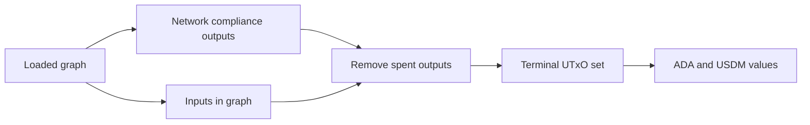

# Query 14 - Network Compliance Terminal State

Runnable SPARQL: [`14-network-compliance-terminal-state.rq`](14-network-compliance-terminal-state.rq)

Back to the [May 2026 lattice demo](../../may-2026-amaru-lattice.md).

## What

This query computes the graph-derived terminal UTxO set for the
network_compliance treasury address. It lists outputs at that address
whose `(txid, index)` is not consumed by any transaction in the loaded
graph.

For each terminal UTxO, it reports tx id, output index, lovelace, and
USDM quantity.

## Why

This is the core state-reconstruction query. The user-facing claim is:
given a start graph and all transactions in the interval, we should be
able to recompute the ending state. If this graph-derived terminal set
does not match the expected current state at the chosen boundary, that
is a bug in graph completeness, graph emission, or the boundary
definition.

For the final-state proof, "all transactions" means every transaction
that can produce or spend a network_compliance output before the live
snapshot boundary. The 30-seed closure is enough for seed-flow analysis,
but it is not enough to prove current state if later address-history
transactions are missing from the loaded graph.

It is stricter than Query 11. Query 11 only asks about USDM-bearing seed
outputs at network_compliance that are not spent by another seed.
Query 14 asks for every terminal network_compliance output visible in
the loaded graph, regardless of whether it was a seed output or a parent
output.

## Diagram



## How

The query resolves the network_compliance address from `rules.yaml` and
pins the full on-chain USDM asset id in a `VALUES` block. It scans all
loaded transactions, not only seeds, for outputs at that address.

For each candidate output, it rejects any output whose `(txid, index)`
appears as an input reference anywhere in the loaded graph:

```sparql
FILTER NOT EXISTS {
  ?spendingTx cardano:hasInput ?input .
  ?input cardano:fromTxOutRef ?ref .
  ?ref cardano:hasTxId/cardano:bytesHex ?txId ;
       cardano:hasIndex ?ix .
}
```

That is the UTxO-set rule expressed directly in SPARQL: an output is
unspent in the graph if no input in the graph spends it.

The optional asset branch sums USDM on each terminal output. Outputs
without USDM remain in the result with a zero USDM aggregate. This makes
the result suitable for comparing both ADA and USDM state.

## SPARQL

```sparql
PREFIX cardano: <https://lambdasistemi.github.io/cardano-knowledge-maps/vocab/cardano#>
PREFIX rdf:     <http://www.w3.org/1999/02/22-rdf-syntax-ns#>
PREFIX rdfs:    <http://www.w3.org/2000/01/rdf-schema#>

# Graph-derived terminal UTxO set for the network_compliance treasury
# address: outputs at the address whose (txid, index) is not consumed by
# any transaction in the loaded graph.
#
# This is the graph-only final-state query. If the loaded graph contains
# the complete transaction set for the interval, this set must match the
# live node UTxO set at the same boundary.
SELECT ?txId ?ix ?lovelace (SUM(COALESCE(?usdmRaw, 0)) AS ?usdm)
WHERE {
  ?networkCompliance rdfs:label "amaru-treasury.network_compliance" ;
                     cardano:bech32 ?networkComplianceBech32 .
  VALUES ?usdmAssetId {
    "c48cbb3d5e57ed56e276bc45f99ab39abe94e6cd7ac39fb402da47ad0014df105553444d"
  }

  ?tx cardano:hasTxId/cardano:bytesHex ?txId ;
      cardano:hasOutput ?out .
  ?out cardano:hasIndex ?ix ;
       cardano:atAddress/cardano:bech32 ?networkComplianceBech32 ;
       cardano:lovelace ?lovelace .

  OPTIONAL {
    ?out cardano:hasAssetValue/rdf:rest*/rdf:first ?asset .
    ?asset cardano:hasIdentifier/cardano:bytesHex ?usdmAssetId ;
           cardano:quantity ?usdmRaw .
  }

  FILTER NOT EXISTS {
    ?spendingTx cardano:hasInput ?input .
    ?input cardano:fromTxOutRef ?ref .
    ?ref cardano:hasTxId/cardano:bytesHex ?txId ;
         cardano:hasIndex ?ix .
  }
}
GROUP BY ?txId ?ix ?lovelace
ORDER BY ?txId ?ix

```

## Result

This table is the CSV result produced by Apache Jena over the state-audit
graph at the live snapshot boundary. ADA quantities are lovelace; USDM
quantities are base units.

| txId | ix | lovelace | usdm |
|---|---|---|---|
| 44454ed0def64621ef645958830f599b488b699b28e3797cc37c4f4dd1463a79 | 1 | 2000000 | 0 |
| 68a1277af23755376967e788752c603044f45ea0d99220b3b5dfc7d617642b6b | 1 | 2306000 | 5011215241 |
| affe90d1fa9a93b3e2a48009ef80634e9de8428640f5d673e85b002a86399982 | 0 | 120299272 | 1349523953 |
| cda0126e9ea7b336bbb338d2bfc7622a41b584e3bebc33c9c320e8895b9bc082 | 1 | 2306000 | 10439974 |
| cda0126e9ea7b336bbb338d2bfc7622a41b584e3bebc33c9c320e8895b9bc082 | 2 | 2306000 | 10439524 |
