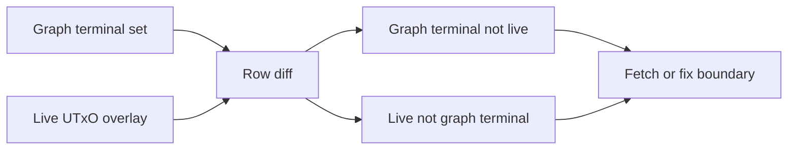

# Query 15 - Network Compliance Live Diff

Runnable SPARQL: [`15-network-compliance-live-diff.rq`](15-network-compliance-live-diff.rq)

Back to the [May 2026 lattice demo](../../may-2026-amaru-lattice.md).


## Result

This table is the CSV result produced by Apache Jena over the state-audit
graph at the live snapshot boundary. ADA quantities are decimal ADA; USDM
quantities are decimal USDM. No data rows were returned.

| side | txId | ix | graphAda | graphUsdm | liveAda | liveUsdm |
| --- | --- | ---: | ---: | ---: | ---: | ---: |

## What

This query compares the graph-derived terminal UTxO set for
network_compliance with a live-node UTxO overlay. It returns row-level
differences between the two sets.

Expected output is no rows. Any returned row is a proof obligation.

## Why

The graph is only useful for correctness if it can reproduce state that
we can independently observe. Query 14 computes the terminal state from
the transaction graph alone. Query 15 checks that computed state against
an external live-node snapshot encoded as RDF.

This is the answer to "if we are not able to prove the current state,
this is a bug." The live diff makes the bug concrete by naming the exact
UTxO that exists only on one side.

The final result below is intentionally empty: after loading the
network_compliance address-history transactions through the live snapshot
boundary, the graph-derived terminal set and the live overlay are the
same set.

## Diagram



## How

The live overlay is expected to contain rows shaped like:

```turtle
[] a live:CurrentUtxo ;
   live:txId "...";
   live:index 0 ;
   live:lovelace 123 ;
   live:usdm 456 .
```

The first branch recomputes the graph terminal set using the same logic
as Query 14. It resolves the network_compliance address from
`rules.yaml` and pins the full on-chain USDM asset id directly in a
`VALUES` block, because USDM is an asset id here, not an overlay entity.
It then filters for graph terminal outputs that do not exist in the live
overlay. Those rows are labeled:

```text
graph_terminal_not_live
```

The second branch scans the live overlay and filters for live UTxOs that
are not present as graph terminal outputs. Those rows are labeled:

```text
live_not_graph_terminal
```

Interpretation:

- `graph_terminal_not_live` usually means the graph is missing a later
  spender transaction.
- `live_not_graph_terminal` usually means the graph is missing the
  producer transaction or the boundary snapshot is ahead of the loaded
  interval.

The row-level output is intentionally operational: it gives the exact
`txId` and `ix` needed to fetch the missing transaction or inspect the
boundary mismatch.

## SPARQL

```sparql
--8<-- "docs/may-2026-amaru-lattice/queries/15-network-compliance-live-diff.rq"
```
