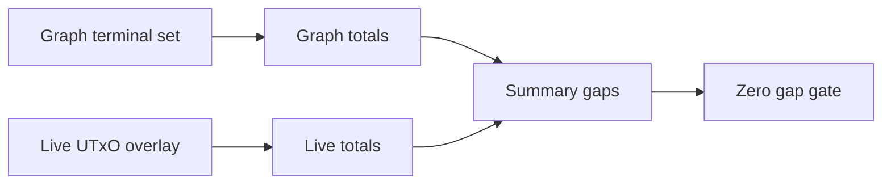

# Query 16 - Network Compliance Live Summary

Runnable SPARQL: [`16-network-compliance-live-summary.rq`](16-network-compliance-live-summary.rq)

Back to the [May 2026 lattice demo](../../may-2026-amaru-lattice.md).

## What

This query is the aggregate form of Query 15. It compares graph-derived
terminal totals with live-node totals for network_compliance and reports
the count, lovelace, and USDM gap.

It does not identify individual mismatching UTxOs. It tells whether the
two state views balance at the summary level.

## Why

The row-level diff is best for debugging. The summary is best for a
quick correctness gate and for presentation. A zero lovelace gap and
zero USDM gap means the graph-derived terminal state and live overlay
agree in aggregate.

This is useful after fixing row-level mismatches. Once Query 15 returns
no rows, Query 16 should also show zero gaps. If Query 16 shows a gap,
use Query 15 to find the exact rows causing it.

This is also the direct answer to the USDM accounting question: the live
snapshot contains 6,381,618,692 USDM base units at network_compliance,
and the graph recomputes the same amount from the loaded transactions.

## Diagram



## How

The query contains two subqueries.

The graph subquery recomputes the terminal network_compliance UTxO set:
all outputs at the network_compliance address for which no loaded input
spends the same `(txid, index)`. It counts those terminal outputs and
sums lovelace and USDM.

The live subquery scans the `live:CurrentUtxo` overlay and counts/sums
the live rows.

The final projection computes:

```text
liveLovelace - graphTerminalLovelace
liveUsdm - graphTerminalUsdm
```

Positive gaps mean the live overlay has more value than the graph's
terminal set. Negative gaps mean the graph terminal set has more value
than the live overlay. A correct complete graph at the same boundary
should produce zero for both gaps.

## SPARQL

```sparql
PREFIX cardano: <https://lambdasistemi.github.io/cardano-knowledge-maps/vocab/cardano#>
PREFIX rdf:     <http://www.w3.org/1999/02/22-rdf-syntax-ns#>
PREFIX live:    <https://lambdasistemi.github.io/cardano-tx-tools/proof/live#>
PREFIX rdfs:    <http://www.w3.org/2000/01/rdf-schema#>

# Summary form of Query 15. It compares graph-derived terminal state
# with the live-node UTxO overlay for the network_compliance treasury
# address.
SELECT ?graphTerminalUtxos ?graphTerminalLovelace ?graphTerminalUsdm
       ?liveUtxos ?liveLovelace ?liveUsdm
       ((?liveLovelace - ?graphTerminalLovelace) AS ?lovelaceGap)
       ((?liveUsdm - ?graphTerminalUsdm) AS ?usdmGap)
WHERE {
  {
    SELECT (COUNT(?txId) AS ?graphTerminalUtxos)
           (SUM(?lovelace) AS ?graphTerminalLovelace)
           (SUM(?usdm) AS ?graphTerminalUsdm)
    WHERE {
      {
        SELECT ?txId ?ix ?lovelace (SUM(COALESCE(?usdmRaw, 0)) AS ?usdm)
        WHERE {
          ?networkCompliance rdfs:label "amaru-treasury.network_compliance" ;
                             cardano:bech32 ?networkComplianceBech32 .
          VALUES ?usdmAssetId {
            "c48cbb3d5e57ed56e276bc45f99ab39abe94e6cd7ac39fb402da47ad0014df105553444d"
          }

          ?tx cardano:hasTxId/cardano:bytesHex ?txId ;
              cardano:hasOutput ?out .
          ?out cardano:hasIndex ?ix ;
               cardano:atAddress/cardano:bech32 ?networkComplianceBech32 ;
               cardano:lovelace ?lovelace .
          OPTIONAL {
            ?out cardano:hasAssetValue/rdf:rest*/rdf:first ?asset .
            ?asset cardano:hasIdentifier/cardano:bytesHex ?usdmAssetId ;
                   cardano:quantity ?usdmRaw .
          }
          FILTER NOT EXISTS {
            ?spendingTx cardano:hasInput ?input .
            ?input cardano:fromTxOutRef ?ref .
            ?ref cardano:hasTxId/cardano:bytesHex ?txId ;
                 cardano:hasIndex ?ix .
          }
        }
        GROUP BY ?txId ?ix ?lovelace
      }
    }
  }
  {
    SELECT (COUNT(?live) AS ?liveUtxos)
           (SUM(?liveLov) AS ?liveLovelace)
           (SUM(?liveUsd) AS ?liveUsdm)
    WHERE {
      ?live a live:CurrentUtxo ;
            live:lovelace ?liveLov ;
            live:usdm ?liveUsd .
    }
  }
}

```

## Result

This table is the CSV result produced by Apache Jena over the state-audit
graph at the live snapshot boundary. ADA quantities are lovelace; USDM
quantities are base units.

| graphTerminalUtxos | graphTerminalLovelace | graphTerminalUsdm | liveUtxos | liveLovelace | liveUsdm | lovelaceGap | usdmGap |
|---|---|---|---|---|---|---|---|
| 5 | 129217272 | 6381618692 | 5 | 129217272 | 6381618692 | 0 | 0 |
