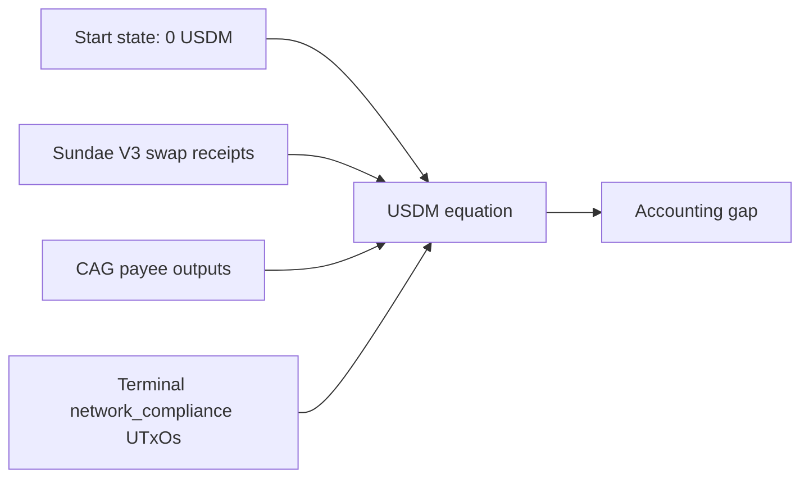

# Query 17 - Network Compliance USDM Accounting

Runnable SPARQL: [`17-network-compliance-usdm-accounting.rq`](17-network-compliance-usdm-accounting.rq)

Back to the [May 2026 lattice demo](../../may-2026-amaru-lattice.md).

## What

This query is the user-facing balance sheet for the May 2026
network_compliance USDM flow. It names the treasury address and reduces
the graph to one accounting equation:

```text
start USDM + swap receipts - beneficiary payments - terminal USDM = gap
```

The query pins the start state at zero USDM because the May report scope
begins before any network_compliance USDM receipts. It then derives all
other values from emitted graph structure.

## Why

This is the direct answer to "why is there 6k USDM left?". The remainder
is not inferred from prose and it is not a live-node lookup. It is the
graph recomputing the equation from transactions:

- 51 swap receipt transactions return `425,131,618,692` USDM base units
  to network_compliance.
- 2 beneficiary payment transactions send `418,750,000,000` USDM base
  units to the CAG payee bridge.
- 5 terminal network_compliance UTxOs hold `6,381,618,692` USDM base
  units.
- The accounting gap is zero.

## Diagram



## How

The query uses four independent subqueries.

The first subquery identifies the network_compliance treasury address
from the rule label. It projects the address so the answer names the
state being checked.

The swap-receipt subquery finds transactions that both consume a
SundaeSwap V3 order script output and emit USDM to the network_compliance
address. It groups by producer transaction before summing, so a scoop
that consumes multiple order inputs does not multiply the returned USDM.

The beneficiary-payment subquery sums USDM outputs to `amaru.cag-payee`.
This is the payee bridge address used by the May payments.

The terminal-state subquery uses the same terminal UTxO test as Query 14:
an output is terminal when no loaded transaction spends its `(txid,
index)`. That proves the remaining USDM from graph topology, not from a
cached balance.

## SPARQL

```sparql
--8<-- "docs/may-2026-amaru-lattice/queries/17-network-compliance-usdm-accounting.rq"
```

## Result

This table is the CSV result produced by Apache Jena over the
state-audit graph. USDM quantities are base units.

| treasuryLabel | treasuryAddress | startUsdm | swapReceiptTxs | swapReceiptsUsdm | beneficiaryPaymentTxs | beneficiaryPaymentsUsdm | terminalUtxos | terminalUsdm | usdmGap |
|---|---|---:|---:|---:|---:|---:|---:|---:|---:|
| amaru-treasury.network_compliance | `addr1xyezq8wpaqnssdjvd3p220uf7e6nzjae44w6yu625y965rfjyqwur6p8pqmycmzz55lcnan4x99mnt2a5fe54ggt4gxs8thzgk` | 0 | 51 | 425131618692 | 2 | 418750000000 | 5 | 6381618692 | 0 |

Read in decimal USDM, that is:

```text
0 + 425,131.618692 - 418,750.000000 - 6,381.618692 = 0
```
