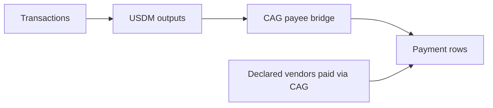

# Query 18 - Beneficiary USDM Payments

Runnable SPARQL: [`18-beneficiary-usdm-payments.rq`](18-beneficiary-usdm-payments.rq)


## Result

This table is the CSV result produced by Apache Jena over the
state-audit graph. ADA quantities are decimal ADA; USDM quantities are
decimal USDM.

| paymentTxId | outputIndex | payeeLabel | payeeAddress | ada | usdm | vendorsPaidViaPayee |
| --- | ---: | --- | --- | ---: | ---: | --- |
| `affe90d1fa9a93b3e2a48009ef80634e9de8428640f5d673e85b002a86399982` | 1 | amaru.cag-payee | `addr1q8qrds2nnx7clx3kcpp2l0eu45twmdcahsfu9m0xcwy59j6xz3vs0hnfaz9nhje8z34kfnds4jyk7hs6dnrag6e2lfgqtyf4rl` | 1.189560 | 400000.000000 | amaru.antithesis, amaru.castellum |
| `c150d5c5c67658c8f2a3bc24e16a4852257d46a03224257ac990fcca6f6fde78` | 1 | amaru.cag-payee | `addr1q8qrds2nnx7clx3kcpp2l0eu45twmdcahsfu9m0xcwy59j6xz3vs0hnfaz9nhje8z34kfnds4jyk7hs6dnrag6e2lfgqtyf4rl` | 1.189560 | 18750.000000 | amaru.antithesis, amaru.castellum |

Total USDM paid to the CAG payee bridge:

```text
400,000.000000 + 18,750.000000 = 418,750.000000
```

## What

This query lists every USDM output paid to the configured CAG payee
bridge during the state-audit interval. It is the payment side of Query
17's accounting equation.

## Why

The remaining USDM is only meaningful if the outgoing payments are also
explicit. Query 18 shows that the graph has two CAG-payee USDM outputs:
one for `400,000` USDM and one for `18,750` USDM. Their sum is the
`418,750,000,000` base-unit beneficiary payment total used in Query 17.

The `vendorsPaidViaPayee` column reports the vendor entities declared as
using the CAG bridge. It is bridge configuration, not a per-output
amount split; the graph proves the payee output amount and address.

## Diagram



## How

The query first resolves `amaru.cag-payee` to its bech32 address from
the rules. It then scans every transaction output at that address and
keeps only outputs carrying the pinned USDM asset id.

The payment rows are grouped by transaction id and output index, so the
result is one row per ledger output. A separate optional join gathers
the vendor labels that declare `cardano:paidVia` that same payee bridge.

## SPARQL

```sparql
--8<-- "docs/may-2026-amaru-lattice/queries/18-beneficiary-usdm-payments.rq"
```
