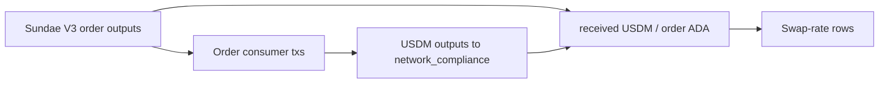

# Query 19 - Swap Receipts And Rates

Runnable SPARQL: [`19-swap-receipts-and-rates.rq`](19-swap-receipts-and-rates.rq)


## Result

This summary is computed from the 51 rows returned by the query. ADA
quantities are decimal ADA; USDM quantities are decimal USDM; rates are
parts per million USDM per ADA.

| rows | totalOrderAda | totalReceivedUsdm | minRatePpm | maxRatePpm | weightedRatePpm |
|---:|---:|---:|---:|---:|---:|
| 51 | 1654998.000000 | 425131.618692 | 243397 | 263822 | 256877 |

Selected rows from the same result set:

| swapTxId | orderInputs | orderAda | receivedUsdm | realizedUsdmPerAdaPpm | orderRefs |
|---|---:|---:|---:|---:|---|
| `26542f223ee27990e35555a7a328299c61e6f802b075b1e00b01befcdb597871` | 1 | 38120.299249 | 10056.971059 | 263822 | `22e914892e83c22e19514937914ca32a0c059f9d1c5b555429edde0ea3406ae4#1` |
| `68a1277af23755376967e788752c603044f45ea0d99220b3b5dfc7d617642b6b` | 1 | 20411.443266 | 5011.215241 | 245510 | `9f119393a85bb9aa0c94f8c649288dabb956b88dcbe055b10e741a2237123420#0` |
| `cda0126e9ea7b336bbb338d2bfc7622a41b584e3bebc33c9c320e8895b9bc082` | 2 | 85.783609 | 20.879498 | 243397 | `10a5c1dafe7dd8d4ab680e35dc53b8b550da90bea55f2c758f36474064f2e598#1`, `10a5c1dafe7dd8d4ab680e35dc53b8b550da90bea55f2c758f36474064f2e598#0` |

The full runnable query returns all 51 swap receipt rows with their
order references.

## What

This query lists each SundaeSwap V3 order consumer that returned USDM to
the network_compliance treasury. For each swap receipt it reports:

- the consumer transaction id,
- the number of consumed order inputs,
- the ADA locked in those order inputs,
- the USDM returned to the treasury,
- the realized USDM-per-ADA rate in parts per million.

`245000` in the rate column means `0.245000 USDM / ADA`.

## Why

The accounting query says the treasury received `425,131.618692` USDM
from swaps. Query 19 shows the individual swap receipts and their
realized rates, so the aggregate is inspectable instead of a black-box
sum.

This is also a rate sanity check. The realized rates cluster around the
submitted floor and the actual scoop outcomes; outliers are visible by
sorting or filtering the returned rows.

## Diagram



## How

The query has two subqueries joined by transaction node.

The first subquery finds producer transactions that consume outputs at
the SundaeSwap V3 order script hash. It sums the ADA at those consumed
order UTxOs and records the consumed order references.

The second subquery finds USDM outputs from the same producer
transactions back to the network_compliance treasury address.

The final projection computes:

```text
round(receivedUsdm * 1,000,000 / orderLovelace)
```

Because both ADA and USDM use six decimal places, that ratio is USDM per
ADA in parts per million.

## SPARQL

```sparql
--8<-- "docs/may-2026-amaru-lattice/queries/19-swap-receipts-and-rates.rq"
```
