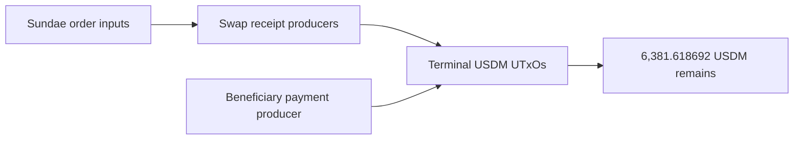

# Query 20 - Terminal USDM Provenance

Runnable SPARQL: [`20-terminal-usdm-provenance.rq`](20-terminal-usdm-provenance.rq)

Back to the [May 2026 lattice demo](../../may-2026-amaru-lattice.md).

## What

This query explains the terminal USDM UTxOs that make up the remaining
`6,381.618692` USDM in the network_compliance treasury. It excludes
terminal ADA-only outputs and focuses on UTxOs that still carry USDM.

## Why

Query 14 proves the terminal state. Query 17 proves the aggregate
accounting equation. Query 20 answers the provenance question for the
remaining USDM: which producer transaction created each terminal USDM
UTxO, and what kind of producer was it?

The result shows that the remaining USDM is split across:

- two swap-receipt producers, and
- one beneficiary-payment transaction's treasury change output.

## Diagram



## How

The terminal subquery finds every USDM-bearing output at
network_compliance that is not spent by any loaded transaction. That is
the graph-derived final-state test.

A producer summary subquery computes the total network_compliance USDM
created by the same producer transaction. This matters when one producer
creates more than one terminal output.

An optional swap subquery classifies a producer as `swap-receipt` when
it consumes one or more SundaeSwap V3 order script outputs.

An optional payment subquery classifies a producer as
`beneficiary-payment-change` when the same transaction also emits USDM
to `amaru.cag-payee`.

## SPARQL

```sparql
--8<-- "docs/may-2026-amaru-lattice/queries/20-terminal-usdm-provenance.rq"
```

## Result

This table is the CSV result produced by Apache Jena over the
state-audit graph. USDM quantities are decimal USDM.

| terminalTxId | terminalIx | terminalUsdm | producerKind | producerNetworkUsdm | swapOrderInputs | swapOrderAda | swapOrderRefs | beneficiaryPaymentUsdm |
|---|---:|---:|---|---:|---:|---:|---|---:|
| `68a1277af23755376967e788752c603044f45ea0d99220b3b5dfc7d617642b6b` | 1 | 5011.215241 | swap-receipt | 5011.215241 | 1 | 20411.443266 | `9f119393a85bb9aa0c94f8c649288dabb956b88dcbe055b10e741a2237123420#0` | 0.000000 |
| `affe90d1fa9a93b3e2a48009ef80634e9de8428640f5d673e85b002a86399982` | 0 | 1349.523953 | beneficiary-payment-change | 1349.523953 |  |  |  | 400000.000000 |
| `cda0126e9ea7b336bbb338d2bfc7622a41b584e3bebc33c9c320e8895b9bc082` | 1 | 10.439974 | swap-receipt | 20.879498 | 2 | 85.783609 | `10a5c1dafe7dd8d4ab680e35dc53b8b550da90bea55f2c758f36474064f2e598#1`, `10a5c1dafe7dd8d4ab680e35dc53b8b550da90bea55f2c758f36474064f2e598#0` | 0.000000 |
| `cda0126e9ea7b336bbb338d2bfc7622a41b584e3bebc33c9c320e8895b9bc082` | 2 | 10.439524 | swap-receipt | 20.879498 | 2 | 85.783609 | `10a5c1dafe7dd8d4ab680e35dc53b8b550da90bea55f2c758f36474064f2e598#1`, `10a5c1dafe7dd8d4ab680e35dc53b8b550da90bea55f2c758f36474064f2e598#0` | 0.000000 |

Summed terminal USDM:

```text
5,011.215241 + 1,349.523953 + 10.439974 + 10.439524
= 6,381.618692
```
