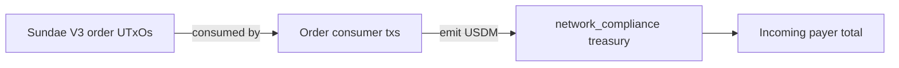

# Query 21 - Treasury USDM Payers

Runnable SPARQL: [`21-treasury-usdm-payers.rq`](21-treasury-usdm-payers.rq)

Back to the [May 2026 lattice demo](../../may-2026-amaru-lattice.md).


## Result

This table is the CSV result produced by Apache Jena over the
state-audit graph. USDM quantities are decimal USDM.

| payerLabel | payerEvidence | treasuryLabel | treasuryAddress | receiptTxs | receiptOutputs | usdmReceived |
| --- | --- | --- | --- | ---: | ---: | ---: |
| sundae.swap.v3.order-consumers | producer consumes Sundae V3 order UTxO and emits USDM to network_compliance | amaru-treasury.network_compliance | `addr1xyezq8wpaqnssdjvd3p220uf7e6nzjae44w6yu625y965rfjyqwur6p8pqmycmzz55lcnan4x99mnt2a5fe54ggt4gxs8thzgk` | 51 | 54 | 425131.618692 |

```text
425,131.618692 USDM paid into network_compliance by SundaeSwap V3 order consumers
```

This aggregate matches Query 17's `swapReceiptsUsdm` value and Query
19's full receipt-by-receipt drill-down.

## What

This query answers the incoming-side question: who paid USDM into the
`amaru-treasury.network_compliance` treasury?

The answer is not an account address. Cardano transactions spend UTxOs
and create new UTxOs, so the graph proves the payer as a producer class:
SundaeSwap V3 order consumers that settle the treasury's swap orders.

For May 2026, the graph returns one incoming payer class:
`sundae.swap.v3.order-consumers`.

## Why

A raw query over "all USDM outputs to network_compliance" is too broad.
It includes:

- swap receipts from external settlement transactions,
- treasury change back to the same address,
- payment change left over after beneficiary payments.

Only the first category is someone paying USDM into the treasury. The
other two categories are internal state continuing through treasury
transactions.

This query is the incoming counterpart to Query 02. Query 02 asks "who
did the treasury pay?" by requiring a treasury input and a payee output.
Query 21 asks "who paid the treasury?" by requiring a SundaeSwap order
input and a treasury USDM output.

## Diagram



## How

The query pins the full on-chain USDM asset id in a `VALUES` block and
resolves the network_compliance treasury address through the
`rules.yaml` label.

It scans USDM outputs to that treasury address, then applies an
`EXISTS` payer proof:

```sparql
FILTER EXISTS {
  ?receiptTx cardano:hasInput ?in .
  ?in cardano:fromTxOutRef ?ref .
  ?ref cardano:hasTxId/cardano:bytesHex ?orderTxId ;
       cardano:hasIndex ?orderIx .
  ?orderTx cardano:hasTxId/cardano:bytesHex ?orderTxId ;
           cardano:hasOutput ?orderOut .
  ?orderOut cardano:hasIndex ?orderIx ;
            cardano:atAddress/cardano:hasPaymentCredential/cardano:hasIdentifier/cardano:bytesHex
              ?orderScriptHash .
}
```

That clause keeps only producer transactions that consume a resolved
SundaeSwap V3 order UTxO. Treasury change and payment change do not pass
that test, so they are excluded from the incoming-payer answer.

The inner subquery groups by receipt output before the outer payer
aggregation. That prevents multiple asset-value nodes on one output from
multiplying the receipt amount.

## SPARQL

```sparql
--8<-- "docs/may-2026-amaru-lattice/queries/21-treasury-usdm-payers.rq"
```
