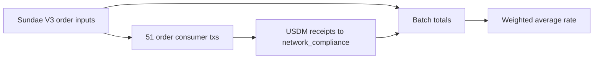

# Query 22 - Swap Average Rate

Runnable SPARQL: [`22-swap-average-rate.rq`](22-swap-average-rate.rq)

Back to the [May 2026 lattice demo](../../may-2026-amaru-lattice.md).

## What

This query computes the aggregate exchange rate for the SundaeSwap V3
swaps that paid USDM into the
`amaru-treasury.network_compliance` treasury.

It returns the number of swap producer transactions, the number of
consumed order inputs, total ADA in those consumed order UTxOs, total
USDM returned to the treasury, and the average realized exchange rate.

## Why

Query 19 lists every swap receipt and its per-producer realized rate.
That is the detailed audit trail. Query 22 reduces the same graph proof
to the summary a user normally asks for: how much ADA went into the swap
orders, how much USDM came back, and what average rate the batch
achieved.

The important average is the weighted rate:

```text
total USDM received / total ADA locked in consumed order inputs
```

That treats the whole batch as one economic exchange. The query also
returns the simple mean of per-swap rates, but that number gives a tiny
swap and a large swap the same weight.

## Diagram



## How

The query builds one proven swap row per producer transaction before
aggregating.

The input-side subquery identifies producer transactions that consume
outputs at the `sundae.swap.v3.order` script hash. It sums the lovelace
held by those consumed order outputs.

The output-side subquery finds USDM outputs from the same producer
transactions to the network_compliance treasury address.

For each producer transaction, the query computes:

```text
round(receivedUsdm * 1,000,000 / orderLovelace)
```

Because both ADA lovelace and USDM base units have six decimals, the
rate is parts-per-million USDM per ADA.

The outer query then computes:

- `weightedUsdmPerAdaPpm` from total USDM and total lovelace,
- `simpleMeanUsdmPerAdaPpm` from the per-producer rates,
- min and max per-producer rates.

## SPARQL

```sparql
--8<-- "docs/may-2026-amaru-lattice/queries/22-swap-average-rate.rq"
```

## Result

This table is the CSV result produced by Apache Jena over the
state-audit graph. ADA and USDM quantities are base units; rates are
parts-per-million USDM per ADA.

| swapTxs | orderInputs | totalOrderLovelace | totalReceivedUsdm | weightedUsdmPerAdaPpm | simpleMeanUsdmPerAdaPpm | minUsdmPerAdaPpm | maxUsdmPerAdaPpm |
|---:|---:|---:|---:|---:|---:|---:|---:|
| 51 | 187 | 1655434240000 | 425131618692 | 256810 | 255580.666666666666666666666667 | 243397 | 263640 |

Read in decimal units:

```text
1,655,434.240000 ADA sold through the consumed orders
425,131.618692 USDM returned to network_compliance
weighted average = 0.256810 USDM / ADA
inverse weighted average = 3.893933 ADA / USDM
```
