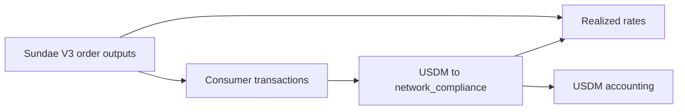

# Swaps And Exchange Rates

This section explains the incoming side of the USDM accounting.

The graph does not label a receipt as a swap because prose says so. A
receipt is counted as a swap receipt only when the producing transaction
consumes a SundaeSwap V3 order output and emits USDM to
network_compliance.

## What Must Hold

The swap receipt total must agree with the incoming term in the USDM
accounting query:

```text
sum(received USDM from swap consumers) = 425,131.618692 USDM
```

The rate rows are derived from the consumed order ADA and the USDM
returned by the same consumer transaction.

## Query Roles

- [Query 19 - Swap receipts and rates](19-swap-receipts-and-rates.md)
  lists every swap receipt and computes the realized rate.
- [Query 08 - Sundae order consumer summary](08-sundae-order-consumer-summary.md)
  groups consumers by how many order inputs they spent.
- [Query 10 - Swap consumer output roles](10-swap-consumer-output-roles.md)
  shows all outputs produced by those same consumer transactions.


