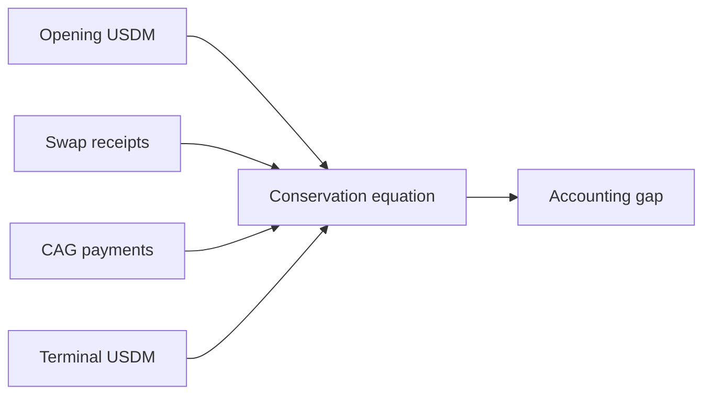

# Treasury USDM Movement

This section is the USDM conservation proof for the audited interval.

The report treats the opening USDM state as an explicit initial
condition. For this May lattice, the opening state is `0 USDM`. The
queries then integrate all in-interval inflows, outflows, and terminal
state from the graph.

```text
opening USDM + incoming USDM - outgoing USDM = terminal USDM
```

## What Must Hold

The accounting gap must be zero, and the semantic classes must agree:

- incoming USDM is produced by SundaeSwap V3 order consumers returning
  USDM to network_compliance,
- outgoing USDM is paid by network_compliance to the CAG payee bridge,
- terminal USDM is held by unspent network_compliance outputs.

## Query Roles

- [Query 17 - Network compliance USDM accounting](../queries/17-network-compliance-usdm-accounting.md)
  is the one-row conservation statement.
- [Query 21 - Treasury USDM payers](../queries/21-treasury-usdm-payers.md)
  identifies who paid USDM into the treasury.
- [Query 07 - Network compliance USDM output classes](../queries/07-network-compliance-usdm-output-classes.md)
  separates incoming receipts from internal continuity/change outputs.
- [Query 02 - Treasury USDM payees](../queries/02-usdm-output-addresses.md)
  identifies who the treasury paid.
- [Query 18 - Beneficiary USDM payments](../queries/18-beneficiary-usdm-payments.md)
  lists the beneficiary payment outputs.
- [Query 05 - Vendor attestations](../queries/05-vendor-attestations.md)
  connects the CAG bridge to the operator-declared vendor attestations.


